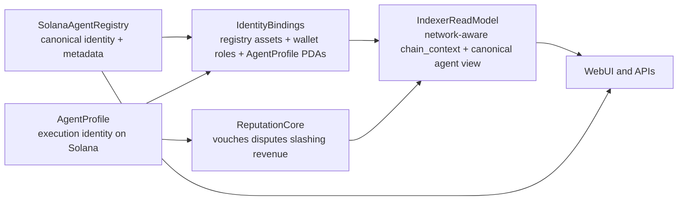

# Agent Registry Recommendation

## Recommendation

Use an `augment + sync` strategy.

- Keep `AgentProfile` as AgentVouch's on-chain execution record for now.
- Add Solana Agent Registry as the canonical identity and discovery layer.
- Introduce bindings between registry-native identity records, wallet roles, and `AgentProfile` PDAs.
- Do not replace `AgentProfile` yet.

This is the best path for multi-chain expansion because it separates:

- portable identity and metadata
- AgentVouch-specific stake, vouch, dispute, and revenue mechanics

The public Solana Agent Registry is a strong fit for identity and interoperability, but it does not replace the economic model AgentVouch already built around `AgentProfile`, `Vouch`, `SkillListing`, disputes, and voucher revenue. See [Solana Agent Registry](https://solana.com/el/agent-registry), [8004-Solana](https://8004.qnt.sh/), and [ERC-8004](https://eips.ethereum.org/EIPS/eip-8004).

## Why I recommend this

Your current system uses `AgentProfile` as more than a profile record.

- It is the authorization and accounting anchor for core instructions in [programs/reputation-oracle/src/instructions/vouch.rs](/Users/andysustic/Repos/agent-reputation-oracle/programs/reputation-oracle/src/instructions/vouch.rs), [programs/reputation-oracle/src/instructions/revoke_vouch.rs](/Users/andysustic/Repos/agent-reputation-oracle/programs/reputation-oracle/src/instructions/revoke_vouch.rs), [programs/reputation-oracle/src/instructions/resolve_dispute.rs](/Users/andysustic/Repos/agent-reputation-oracle/programs/reputation-oracle/src/instructions/resolve_dispute.rs), [programs/reputation-oracle/src/instructions/create_skill_listing.rs](/Users/andysustic/Repos/agent-reputation-oracle/programs/reputation-oracle/src/instructions/create_skill_listing.rs), [programs/reputation-oracle/src/instructions/purchase_skill.rs](/Users/andysustic/Repos/agent-reputation-oracle/programs/reputation-oracle/src/instructions/purchase_skill.rs), and [programs/reputation-oracle/src/instructions/claim_voucher_revenue.rs](/Users/andysustic/Repos/agent-reputation-oracle/programs/reputation-oracle/src/instructions/claim_voucher_revenue.rs).
- The current data model already couples identity to economics in [programs/reputation-oracle/src/state/agent.rs](/Users/andysustic/Repos/agent-reputation-oracle/programs/reputation-oracle/src/state/agent.rs):

```4:14:programs/reputation-oracle/src/state/agent.rs
pub struct AgentProfile {
    pub authority: Pubkey,
    pub metadata_uri: String,
    pub reputation_score: u64,
    pub total_vouches_received: u32,
    pub total_vouches_given: u32,
    pub total_staked_for: u64,
    pub disputes_won: u32,
    pub disputes_lost: u32,
    pub registered_at: i64,
    pub bump: u8,
}
```

Replacing `AgentProfile` now would force a redesign of PDA derivation, authorization rules, vouch relationships, revenue claims, and much of the client/API layer.

Additional findings from the 8004 research that matter for the schema:

- ERC-8004 treats **identity, reputation, and validation as separate registries**, and explicitly treats payments as orthogonal. That matches AgentVouch best if the registry layer is used for identity only, not for marketplace settlement. See [ERC-8004](https://eips.ethereum.org/EIPS/eip-8004).
- The Solana 8004 implementation uses a **Metaplex Core asset pubkey as the unique agent identifier**, not a wallet and not a local PDA. See [8004-Solana](https://8004.qnt.sh/) and [8004 technical docs](https://quantulabs.github.io/8004-solana/).
- 8004 also separates the **owner** from the **agent wallet / operational wallet**, so the binding model must capture wallet roles instead of treating all wallets as equivalent. See [ERC-8004](https://eips.ethereum.org/EIPS/eip-8004) and the [8004-solana SDK skill](https://raw.githubusercontent.com/QuantuLabs/8004-solana-ts/main/skill.md).
- The 8004 registration file has a `registrations[]` list for cross-registry / cross-chain references, which is a natural upstream input for `agent_identity_bindings`. See [ERC-8004](https://eips.ethereum.org/EIPS/eip-8004).

Your docs already point toward a better long-term split:

- [docs/cross-chain-agent-schema-proposal.plan.md](/Users/andysustic/Repos/agent-reputation-oracle/docs/cross-chain-agent-schema-proposal.plan.md) already proposes `canonical_agent_id` and `agent_identity_bindings`.
- [docs/multi-asset-staking-and-x402.plan.md](/Users/andysustic/Repos/agent-reputation-oracle/docs/multi-asset-staking-and-x402.plan.md) already separates payment rails from the reputation core and introduces `chain_context`.
- [docs/ARCHITECTURE_ANALYSIS.md](/Users/andysustic/Repos/agent-reputation-oracle/docs/ARCHITECTURE_ANALYSIS.md) clearly shows the current 60/40 marketplace and stake-backed trust model.

## Recommended target architecture




## What to do now

1. Treat Solana Agent Registry as the source of truth for portable agent identity.

- Store or resolve canonical IDs as registry-native identity records, not wallets and not `AgentProfile` PDAs.
- `canonical_agent_id` here is an AgentVouch-defined identifier whose chain prefix is a CAIP-2 chain ID. It is not itself a CAIP standard.
- For EVM 8004 identities, use the ERC-8004 shape directly:
  - `eip155:<chainId>:<identityRegistry>#<tokenId>`
- For Solana 8004 identities, make the Solana record explicit:
  - `solana:5eykt4UsFv8P8NJdTREpY1vzqKqZKvdp:<agentRegistryProgram>#<coreAssetPubkey>`
  - `solana:EtWTRABZaYq6iMfeYKouRu166VU2xqa1:<agentRegistryProgram>#<coreAssetPubkey>`
- Keep the external record ID lossless: for Solana that means the Core asset pubkey; for EVM that means the ERC-721 token id.
- Use the registry for rich metadata, discovery, and future multi-wallet / delegated identity.

1. Keep `AgentProfile` as the source of truth for AgentVouch economics.

- Continue using it for vouching, disputes, skill listing ownership, and voucher revenue accounting.
- Keep PDA-based authorization intact until you deliberately redesign the on-chain program.

1. Add a binding layer instead of replacing the profile layer.

- Introduce explicit mappings between:
  - canonical registry-backed agent ID
  - `solana_8004_asset`
  - `wallet_owner`
  - `wallet_operational`
  - `agent_profile_pda`
  - future `evm_8004_token` or other external identity records
- Treat wallet roles separately. The owner wallet and operational wallet are not the same concept in 8004.
- Do not assume one wallet maps to one agent globally.
- Tighten `agent_identity_bindings` so uniqueness applies to identity records like registry assets and PDAs, not all wallet addresses.
- This refines the proposed `agent_identity_bindings` model in [docs/cross-chain-agent-schema-proposal.plan.md](/Users/andysustic/Repos/agent-reputation-oracle/docs/cross-chain-agent-schema-proposal.plan.md).

1. Move multi-chain aggregation into the indexer/read model before moving it into the program.

- Add `chain_context` everywhere the docs already suggest.
- Make `chain_context` network-specific with CAIP-2 values, not just chain-family-specific labels:
  - `solana:5eykt4UsFv8P8NJdTREpY1vzqKqZKvdp`
  - `solana:EtWTRABZaYq6iMfeYKouRu166VU2xqa1`
  - `eip155:8453`
- Use `VARCHAR(64)` or `TEXT` for normalized `chain_context` fields.
- Preserve non-standard upstream chain labels separately in raw metadata or dedicated `raw_upstream_*` fields for easier SDK / registry interop.
- Build unified agent views off-chain first.
- Let the UI show one logical agent with many bindings, while settlement stays chain-specific.
- Parse and ingest upstream `registrations[]` references from 8004 registration files as candidate foreign bindings, but require explicit verification rules before treating them as trusted.

1. Only consider replacing `AgentProfile` after a second-phase protocol redesign.

- That redesign would need to rework how vouch PDAs are derived, how authorization works, how disputes mutate reputation, and how claims reference the voucher/author identity pair.
- That is a major migration, not a small integration.

## What not to do

- Do not replace `AgentProfile` immediately with registry-only identity.
- Do not make the external registry the primary key for skills, purchases, disputes, or payouts.
- Do not use a wallet address as the canonical agent identity when a registry-native record exists.
- Do not assume the registry owner wallet and the operational wallet are the same actor.
- Do not enforce a blanket `UNIQUE(chain_context, address)` rule on wallet bindings.
- Do not persist `solana`, `solana:mainnet`, or `solana:mainnet-beta` as normalized `chain_context` values.
- Do not use raw upstream chain labels as join keys, foreign keys, or normalized filters.
- Do not mix registry feedback/reputation with AgentVouch's stake-backed score without clearly labeling them as separate trust signals.

## Best phased rollout

1. Phase 1: UI and API integration

- Show registry identity alongside existing `AgentProfile` data.
- Add optional linking between registry identity and current agent profile.
- Display or resolve the registry asset, owner wallet, operational wallet, and registration file metadata without changing current settlement or authorization.
- Where compatibility requires it, allow transport-layer responses to carry both a legacy field and a normalized CAIP-2 field during transition. Example: x402 can keep `network: 'solana'` for compatibility while also carrying normalized `chainContext`.
- Keep all current on-chain flows unchanged.

1. Phase 2: Read-model unification

- Add canonical agent IDs and identity bindings in the database/indexer.
- Add network-specific CAIP-2 `chain_context` to events and read models.
- Ingest `registrations[]` references from 8004 registration files as cross-chain identity hints.
- Support multi-chain discovery without changing settlement.

1. Phase 3: Protocol redesign if justified

- Only if the product needs registry-native authorization on-chain.
- Re-evaluate whether `AgentProfile` should become a thin binding or disappear.

## Bottom line

For future proofing, integrate the Solana Agent Registry above `AgentProfile`, not instead of it.

That gives AgentVouch:

- standard identity and discovery now
- a cleaner path to multi-chain agent aggregation that matches both ERC-8004 and Solana 8004
- no immediate breakage to vouching, disputes, skill ownership, or revenue sharing
- optional later migration if the registry becomes mature enough to justify a protocol rewrite

