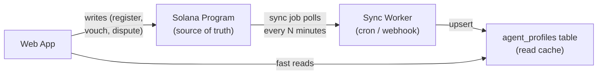

# Agent Profiles Postgres Cache

## When to Implement

Not now. Revisit when:

- RPC rate limits become a bottleneck (50+ agents, frequent page loads)
- Richer agent metadata is needed (display names, bios, avatars)
- Mainnet migration makes RPC costs matter
- Agent search/discovery becomes a product requirement

## Architecture

On-chain remains the source of truth. Postgres is a read cache with optional extended metadata.




## Schema

New table in Neon Postgres:

```sql
CREATE TABLE agent_profiles (
  id UUID PRIMARY KEY DEFAULT gen_random_uuid(),
  authority TEXT NOT NULL UNIQUE,          -- wallet pubkey (on-chain key)
  profile_pda TEXT NOT NULL UNIQUE,        -- derived PDA address
  metadata_uri TEXT,
  reputation_score BIGINT NOT NULL DEFAULT 0,
  total_staked_for BIGINT NOT NULL DEFAULT 0,
  total_vouches_received INT NOT NULL DEFAULT 0,
  total_vouches_given INT NOT NULL DEFAULT 0,
  disputes_lost INT NOT NULL DEFAULT 0,
  registered_at TIMESTAMPTZ NOT NULL,
  -- Extended metadata (not on-chain)
  display_name TEXT,
  bio TEXT,
  avatar_url TEXT,
  contact TEXT,
  -- Cache management
  synced_at TIMESTAMPTZ NOT NULL DEFAULT NOW(),
  created_at TIMESTAMPTZ NOT NULL DEFAULT NOW(),
  updated_at TIMESTAMPTZ NOT NULL DEFAULT NOW()
);

CREATE INDEX idx_agent_profiles_authority ON agent_profiles(authority);
CREATE INDEX idx_agent_profiles_reputation ON agent_profiles(reputation_score DESC);
```

## Changes

### 1. Migration file

Add the table via Prisma migration or raw SQL in [web/app/api/setup/route.ts](web/app/api/setup/route.ts).

### 2. Sync worker

New file: `web/lib/sync-agents.ts`

- Calls `getProgramAccounts` with the `AGENT_PROFILE_DISCRIMINATOR` filter (same as `useReputationOracle.getAllAgents()`)
- Upserts each decoded account into `agent_profiles`
- Updates `synced_at` timestamp
- Can be called from a cron API route (`/api/cron/sync-agents`) or triggered after write transactions

### 3. Update `resolveAuthorTrust` in [web/lib/trust.ts](web/lib/trust.ts)

- Read from Postgres first (cache hit)
- Fall back to on-chain RPC if not in cache or stale (>5 min)
- Write-through: update Postgres after RPC fetch

### 4. Update `resolveMultipleAuthorTrust` in [web/lib/trust.ts](web/lib/trust.ts)

- Batch read from Postgres instead of N individual RPC calls
- Single SQL query replaces N `getProgramAccounts` calls

### 5. Landing page metrics

[web/app/page.tsx](web/app/page.tsx) currently calls `oracle.getAllAgents()` client-side. Replace with a server-side API that reads from Postgres — eliminates the slow client-side RPC fan-out.

### 6. Agent search API (optional)

New endpoint `GET /api/agents?q=&sort=` for discovering agents by name, reputation, etc. Currently not possible with on-chain-only data.

## What stays the same

- All **write** operations (register, vouch, dispute) go directly to Solana
- The `useReputationOracle` hook stays for wallet-connected write flows
- On-chain is always authoritative — Postgres can be rebuilt from chain at any time

## Risk

Low. Postgres is purely a read cache. If sync breaks, the app falls back to direct RPC calls (current behavior). No data loss scenario since on-chain is the source of truth.