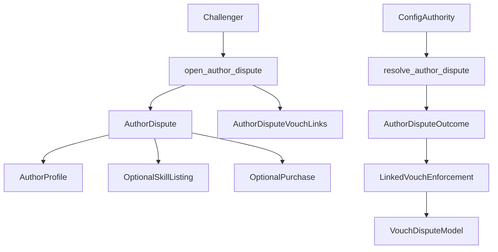

# Phase 2 Author Dispute Model

## Goal

Introduce a first-class `AuthorDispute` primitive so AgentVouch can represent `open dispute against this author` directly on-chain, while preserving the current vouch-level dispute model as the enforcement layer during transition.

Assumptions for this phase:

- Resolver remains the current centralized `config.authority`.
- Author-bonded stake is out of scope for this plan.
- Existing `open_dispute` and `resolve_dispute` stay live during Phase 2.
- Self-vouch remains disallowed; `Vouch` remains reserved for external endorsement only.

## Canonical Naming

Use `dispute` as the canonical term for adversarial challenges.

- `AuthorDispute` = the new author-native object introduced in Phase 2
- `VouchDispute` = the current lower-level dispute against a single `Vouch` PDA
- `Report` = the user-facing action label that opens a dispute
- Avoid `claim` in dispute UX because it conflicts with revenue claim and withdrawal language

This plan uses `Report` for end-user entry points, `AuthorDispute` for the new protocol object, and `VouchDispute` for the current on-chain `Dispute` account when that distinction matters.

## Scope

This phase should add:

- an author-native `AuthorDispute` account
- author dispute open / resolve instructions
- optional dispute links to `SkillListing` and `Purchase`
- author-dispute-to-vouch linkage so one author dispute can point to multiple backing vouchers
- UI and indexing changes to show author disputes as first-class protocol objects

This phase should not add:

- author stake or escrow
- author-slash economics
- DAO or multisig governance changes
- per-skill bond models
- self-stake by repurposing `Vouch`

## Current Constraints

The current protocol only disputes a single vouch:

- `[/Users/andysustic/Repos/agent-reputation-oracle/programs/reputation-oracle/src/instructions/open_dispute.rs](/Users/andysustic/Repos/agent-reputation-oracle/programs/reputation-oracle/src/instructions/open_dispute.rs)`
- `[/Users/andysustic/Repos/agent-reputation-oracle/programs/reputation-oracle/src/state/dispute.rs](/Users/andysustic/Repos/agent-reputation-oracle/programs/reputation-oracle/src/state/dispute.rs)`

The current user-facing report entry point already exists, but it is still routed through vouch disputes:

- `[/Users/andysustic/Repos/agent-reputation-oracle/web/app/author/[pubkey]/page.tsx](/Users/andysustic/Repos/agent-reputation-oracle/web/app/author/[pubkey]/page.tsx)`
- `[/Users/andysustic/Repos/agent-reputation-oracle/web/app/dashboard/page.tsx](/Users/andysustic/Repos/agent-reputation-oracle/web/app/dashboard/page.tsx)`

The trust model currently stores voucher-oriented dispute counters on `AgentProfile`:

- `[/Users/andysustic/Repos/agent-reputation-oracle/programs/reputation-oracle/src/state/agent.rs](/Users/andysustic/Repos/agent-reputation-oracle/programs/reputation-oracle/src/state/agent.rs)`

## Proposed Data Model

Add a new `AuthorDispute` account keyed by author plus dispute id.

Recommended fields:

- `author: Pubkey`
- `challenger: Pubkey`
- `reason: AuthorDisputeReason`
- `evidence_uri: String`
- `status: AuthorDisputeStatus`
- `ruling: Option<AuthorDisputeRuling>`
- `skill_listing: Option<Pubkey>`
- `purchase: Option<Pubkey>`
- `created_at: i64`
- `resolved_at: Option<i64>`
- `bump: u8`

Add a second account for author-dispute-to-vouch links so one author dispute can reference multiple active backing vouchers without overloading the main account.

Recommended shape:

- `AuthorDisputeVouchLink { author_dispute, vouch, added_at, bump }`

This avoids stretching the current `Dispute` PDA model, which is one-per-vouch today.

## Protocol Shape

## Implementation Plan

### 1. Add New On-Chain Accounts

Create new state types under:

- `[/Users/andysustic/Repos/agent-reputation-oracle/programs/reputation-oracle/src/state/mod.rs](/Users/andysustic/Repos/agent-reputation-oracle/programs/reputation-oracle/src/state/mod.rs)`
- `[/Users/andysustic/Repos/agent-reputation-oracle/programs/reputation-oracle/src/state/agent.rs](/Users/andysustic/Repos/agent-reputation-oracle/programs/reputation-oracle/src/state/agent.rs)`
- `[/Users/andysustic/Repos/agent-reputation-oracle/programs/reputation-oracle/src/state/skill_listing.rs](/Users/andysustic/Repos/agent-reputation-oracle/programs/reputation-oracle/src/state/skill_listing.rs)`
- `[/Users/andysustic/Repos/agent-reputation-oracle/programs/reputation-oracle/src/state/purchase.rs](/Users/andysustic/Repos/agent-reputation-oracle/programs/reputation-oracle/src/state/purchase.rs)`

Work:

- Add `author_dispute.rs` for `AuthorDispute`, `AuthorDisputeReason`, `AuthorDisputeStatus`, `AuthorDisputeRuling`
- Add `author_dispute_vouch_link.rs` for author-dispute-to-vouch edges
- Export both from `state/mod.rs`

### 2. Add Author Dispute Instructions

Implement:

- `open_author_dispute`
- `resolve_author_dispute`
- optional helper instruction for attaching additional vouches if needed

Primary files:

- `[/Users/andysustic/Repos/agent-reputation-oracle/programs/reputation-oracle/src/instructions/mod.rs](/Users/andysustic/Repos/agent-reputation-oracle/programs/reputation-oracle/src/instructions/mod.rs)`
- `[/Users/andysustic/Repos/agent-reputation-oracle/programs/reputation-oracle/src/instructions/open_dispute.rs](/Users/andysustic/Repos/agent-reputation-oracle/programs/reputation-oracle/src/instructions/open_dispute.rs)`
- `[/Users/andysustic/Repos/agent-reputation-oracle/programs/reputation-oracle/src/instructions/resolve_dispute.rs](/Users/andysustic/Repos/agent-reputation-oracle/programs/reputation-oracle/src/instructions/resolve_dispute.rs)`
- `[/Users/andysustic/Repos/agent-reputation-oracle/programs/reputation-oracle/src/state/config.rs](/Users/andysustic/Repos/agent-reputation-oracle/programs/reputation-oracle/src/state/config.rs)`

Work:

- Keep `config.authority` as the resolver gate
- Validate author, optional skill, and optional purchase references at open time
- Allow one author dispute to point to multiple active backing vouchers through link accounts
- Resolve author dispute status separately from low-level vouch penalties

### 3. Define Enforcement Boundary

Phase 2 should keep author disputes and vouch disputes distinct:

- `AuthorDispute` is the semantic object users and UIs reason about
- `Dispute` remains the low-level slashable-vouch primitive and should be referred to as a `VouchDispute` in product-facing docs and UI where needed

Implementation rule:

- `resolve_author_dispute` should record whether the author was at fault
- linked voucher penalties should be triggered through explicit linked-vouch enforcement, not by pretending the author dispute itself is already the slash object

This preserves a clean migration path into Phase 3.

### 4. Add Events And Client Generation

Update:

- `[/Users/andysustic/Repos/agent-reputation-oracle/programs/reputation-oracle/src/events.rs](/Users/andysustic/Repos/agent-reputation-oracle/programs/reputation-oracle/src/events.rs)`
- `[/Users/andysustic/Repos/agent-reputation-oracle/programs/reputation-oracle/src/lib.rs](/Users/andysustic/Repos/agent-reputation-oracle/programs/reputation-oracle/src/lib.rs)`
- generated client artifacts under `[/Users/andysustic/Repos/agent-reputation-oracle/web/generated/reputation-oracle/src/generated](/Users/andysustic/Repos/agent-reputation-oracle/web/generated/reputation-oracle/src/generated)`

Work:

- add `AuthorDisputeOpened` and `AuthorDisputeResolved`
- expose generated TS clients for author dispute accounts and instructions
- keep existing dispute clients intact

### 5. Add Web Report Entry Points And Author Dispute Surfaces

Primary surfaces:

- `[/Users/andysustic/Repos/agent-reputation-oracle/web/app/author/[pubkey]/page.tsx](/Users/andysustic/Repos/agent-reputation-oracle/web/app/author/[pubkey]/page.tsx)`
- `[/Users/andysustic/Repos/agent-reputation-oracle/web/app/skills/[id]/page.tsx](/Users/andysustic/Repos/agent-reputation-oracle/web/app/skills/[id]/page.tsx)`
- `[/Users/andysustic/Repos/agent-reputation-oracle/web/app/dashboard/page.tsx](/Users/andysustic/Repos/agent-reputation-oracle/web/app/dashboard/page.tsx)`
- `[/Users/andysustic/Repos/agent-reputation-oracle/web/hooks/useReputationOracle.ts](/Users/andysustic/Repos/agent-reputation-oracle/web/hooks/useReputationOracle.ts)`
- `[/Users/andysustic/Repos/agent-reputation-oracle/web/components/TrustBadge.tsx](/Users/andysustic/Repos/agent-reputation-oracle/web/components/TrustBadge.tsx)`

Work:

- author page uses `Report` as the primary user-facing action and lists first-class author disputes
- skill page can deep-link into a prefilled author report that opens an `AuthorDispute`
- dashboard gets an author dispute management view separate from raw vouch disputes
- add client hooks for `openAuthorDispute`, `resolveAuthorDispute`, and author dispute lookup
- extend trust presentation with author-dispute-specific metrics instead of overloading current dispute counters
- keep admin and protocol-facing labels as `Dispute`, not `Report`

### 6. Add Read Models And Metrics

Current `AgentProfile` dispute counters are voucher-oriented. Phase 2 should add separate read-path metrics for author disputes.

Recommended metrics to expose in read models and UI:

- `disputes_against_author`
- `disputes_upheld_against_author`
- `active_disputes_against_author`

Primary docs and UI references:

- `[/Users/andysustic/Repos/agent-reputation-oracle/ARCHITECTURE.md](/Users/andysustic/Repos/agent-reputation-oracle/ARCHITECTURE.md)`
- `[/Users/andysustic/Repos/agent-reputation-oracle/VISION.md](/Users/andysustic/Repos/agent-reputation-oracle/VISION.md)`
- `[/Users/andysustic/Repos/agent-reputation-oracle/web/components/TrustBadge.tsx](/Users/andysustic/Repos/agent-reputation-oracle/web/components/TrustBadge.tsx)`

### 7. Test And Migration Review

Primary validation targets:

- program tests in `[/Users/andysustic/Repos/agent-reputation-oracle/tests](/Users/andysustic/Repos/agent-reputation-oracle/tests)`
- web tests in `[/Users/andysustic/Repos/agent-reputation-oracle/web/__tests__](/Users/andysustic/Repos/agent-reputation-oracle/web/__tests__)`
- upgrade constraints in `[/Users/andysustic/Repos/agent-reputation-oracle/docs/program-upgrades-and-redploys.md](/Users/andysustic/Repos/agent-reputation-oracle/docs/program-upgrades-and-redploys.md)`

Test cases:

- open an author dispute without a skill reference
- open an author dispute tied to a specific skill listing
- open an author dispute tied to a purchase
- attach multiple backing vouchers to one author dispute
- resolve author dispute while leaving vouch dispute enforcement explicit and traceable
- verify existing vouch dispute flows still work
- regenerate clients, run web tests, and run build

## Risks

- Current `Dispute` topology is one-per-vouch, so Phase 2 should not try to reuse it as the main author dispute object.
- `AgentProfile.disputesWon` and `disputesLost` are still voucher-centric and should not be reinterpreted as author dispute metrics.
- Existing docs already have some dispute semantic drift, so Phase 2 should update architecture and UI language together.
- Relaxing the self-vouch restriction later would blur endorsement and self-bond semantics, so Phase 2 should keep `Vouch` clean and leave self-stake to a distinct `AuthorBond` object.

## Exit Criteria

- An author dispute can be opened directly against an author on-chain.
- An author dispute can optionally reference a skill or purchase.
- One author dispute can reference multiple backing vouchers.
- Web surfaces treat author disputes as first-class objects.
- Existing vouch disputes remain operational during transition.
- Tests and build pass after client regeneration.

## Next Steps

Phase 3 should be planned separately after Phase 2 is agreed:

- add registration-level `AuthorBond` / self-stake as a first-class object
- define author-slash rules and withdrawal locks
- define slash ordering with `AuthorBond` as first-loss capital ahead of backing vouchers
- define explicit `AuthorBond` reward mechanics separate from voucher revenue share
- add author-bond metrics to trust and marketplace surfaces
