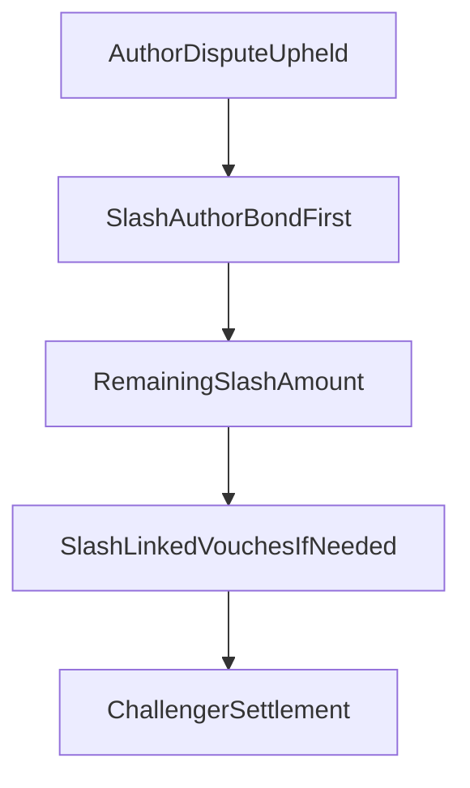

# AuthorBond V1 Implementation Plan

## Scope
Implement a minimal `AuthorBond` / `SelfStake` v1 that keeps `Vouch` as external endorsement, adds first-loss self-stake for authors, and requires a minimum bond for free on-chain listings.

Chosen defaults for this plan:
- `AuthorBond` is a separate first-class account, not self-vouch.
- Upheld `AuthorDispute` slashes `AuthorBond` before linked backing vouchers.
- Free on-chain listings require a minimum bond.
- `AuthorBond` counts in trust / reputation score in v1.
- No separate bond rewards yet.

## Program Design
Add a new `AuthorBond` PDA owned by the author profile authority and extend config so the program can enforce free-listing bond requirements.

Primary files:
- [programs/reputation-oracle/src/lib.rs](programs/reputation-oracle/src/lib.rs)
- [programs/reputation-oracle/src/state/mod.rs](programs/reputation-oracle/src/state/mod.rs)
- [programs/reputation-oracle/src/state/config.rs](programs/reputation-oracle/src/state/config.rs)
- [programs/reputation-oracle/src/state/agent.rs](programs/reputation-oracle/src/state/agent.rs)
- [programs/reputation-oracle/src/instructions/mod.rs](programs/reputation-oracle/src/instructions/mod.rs)
- [programs/reputation-oracle/src/instructions/create_skill_listing.rs](programs/reputation-oracle/src/instructions/create_skill_listing.rs)
- [programs/reputation-oracle/src/instructions/resolve_author_dispute.rs](programs/reputation-oracle/src/instructions/resolve_author_dispute.rs)
- [programs/reputation-oracle/src/instructions/initialize_config.rs](programs/reputation-oracle/src/instructions/initialize_config.rs)

New pieces:
- `state/author_bond.rs` with fields like `author`, `amount`, `created_at`, `updated_at`, `bump`.
- `deposit_author_bond` and `withdraw_author_bond` instructions.
- Config fields such as `min_author_bond_for_free_listing` and any needed feature flag if you want free listings to remain explicitly opt-in.
- `AgentProfile` scoring inputs updated so bond contributes to trust calculations without being mislabeled as external voucher stake.

Slash order target:

## Protocol Changes
Wire `AuthorBond` into author disputes and listing creation with minimal surface-area changes.

Key rules:
- `resolve_author_dispute` should compute slash against `AuthorBond` first, then continue into the existing linked-vouch settlement path only if policy requires remaining loss coverage.
- `create_skill_listing` should reject `price_lamports == 0` unless the author’s bond meets the configured threshold.
- Keep the current paid-listing behavior intact so this change does not force a redesign of existing paid marketplace flows.
- Keep self-vouch disallowed in [programs/reputation-oracle/src/instructions/vouch.rs](programs/reputation-oracle/src/instructions/vouch.rs).

## Client And Read Model Updates
Expose bond state distinctly in the UI, even though it contributes to score in v1.

Primary files:
- [web/hooks/useReputationOracle.ts](web/hooks/useReputationOracle.ts)
- [web/app/api/author/[pubkey]/route.ts](web/app/api/author/[pubkey]/route.ts)
- [web/app/api/agents/[pubkey]/trust/route.ts](web/app/api/agents/[pubkey]/trust/route.ts)
- [web/lib/trust.ts](web/lib/trust.ts)
- [web/app/author/[pubkey]/page.tsx](web/app/author/[pubkey]/page.tsx)
- [web/app/dashboard/page.tsx](web/app/dashboard/page.tsx)
- [web/components/TrustBadge.tsx](web/components/TrustBadge.tsx)
- [web/generated/reputation-oracle/src/generated](web/generated/reputation-oracle/src/generated)
- [web/reputation_oracle.json](web/reputation_oracle.json)

Read-model goals:
- Add `authorBondLamports` and `totalStakeAtRisk` style fields so the UI can separate self-stake from external endorsement.
- Update trust score assembly in [web/lib/trust.ts](web/lib/trust.ts) so bond contributes to score without inflating `totalVouchesReceived` semantics.
- Add hook helpers for fetching, depositing, and withdrawing `AuthorBond`.

## Docs And Product Alignment
Update docs so the economic model matches the implemented protocol.

Primary files:
- [docs/ARCHITECTURE.md](docs/ARCHITECTURE.md)
- [docs/AUTHORBOND_VS_SELFVOUCH.md](docs/AUTHORBOND_VS_SELFVOUCH.md)
- [web/public/skill.md](web/public/skill.md)

Doc changes:
- Move `AuthorBond` from future direction to implemented protocol if shipped.
- Explain that free listings require author first-loss capital instead of pushing all downside to vouchers.
- Keep `Vouch` defined as external endorsement only.

## Verification
Validate the full stack because this changes on-chain interfaces and trust math.

Verification steps:
- Add/extend Anchor tests for deposit, withdraw, free-listing gating, and upheld-dispute slash ordering.
- Run `anchor build` to refresh `target/idl` and `target/types`.
- Sync [web/reputation_oracle.json](web/reputation_oracle.json) and regenerate [web/generated/reputation-oracle/src/generated](web/generated/reputation-oracle/src/generated).
- Run targeted web tests for trust/API surfaces.
- Run `npm run build` in [web/](web/).

Success criteria:
- Authors can post self-stake without weakening `Vouch` semantics.
- Upheld author disputes hit author capital first.
- Free listings are blocked unless minimum bond conditions are met.
- Trust surfaces show both external backing and author self-stake clearly, while score math includes the bond as chosen for v1.