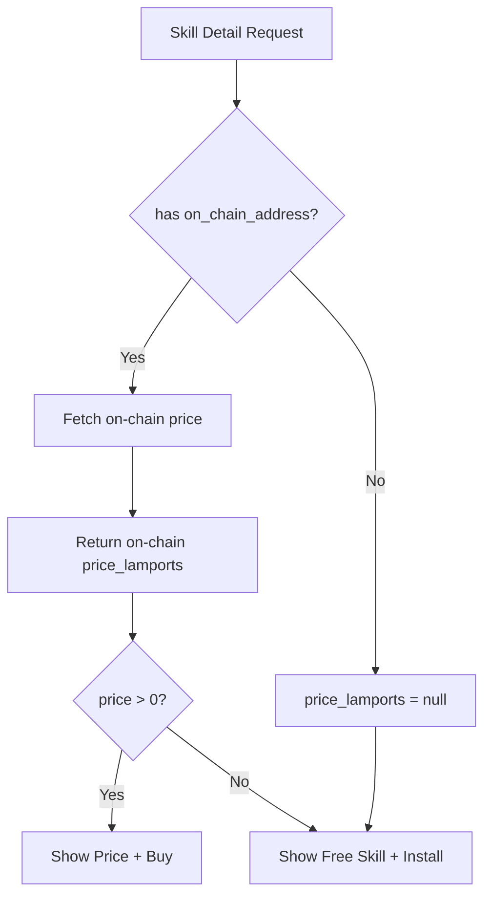

# Clean Up Skill Pricing Logic

## The Problem

The pricing logic is split across 5+ files with no single source of truth. Current bugs:

1. **Repo skills ignore on-chain price.** `GET /api/skills/{id}` for repo skills returns `price_lamports` from the DB (which is null/0) even when an on-chain listing has a real price. So the UI shows "Free Skill" for a paid skill.
2. **The raw endpoint is correct but the UI isn't.** `/api/skills/{id}/raw` fetches the on-chain price and gates content correctly, but the detail page doesn't know about it.
3. **The publish page still says "Set 0 for free"** even though the contract rejects `price_lamports: 0`.

## The Fix: On-chain price is authoritative



## Changes

### 1. API: Enrich repo skills with on-chain price -- [web/app/api/skills/[id]/route.ts](web/app/api/skills/[id]/route.ts)

For UUID-based (repo) skills that have `on_chain_address`, fetch the on-chain listing price and override `price_lamports` in the response. Reuse the same `getOnChainPrice` function from the raw route (extract to a shared util or inline).

In the `GET` handler, after fetching from DB (line ~96), add:

```typescript
if (skill.on_chain_address) {
  const listing = await getOnChainPrice(skill.on_chain_address);
  if (listing) {
    skill.price_lamports = listing.price;
  }
}
```

This makes the single `/api/skills/{id}` response the source of truth for pricing.

### 2. Extract `getOnChainPrice` to shared util -- new [web/lib/onchain.ts](web/lib/onchain.ts)

Both `raw/route.ts` and `[id]/route.ts` need to fetch on-chain price. Extract the existing `getOnChainPrice` function to `web/lib/onchain.ts` and import from both routes. Avoids duplication.

### 3. UI detail page: remove "Paid skills require an on-chain purchase" line -- [web/app/skills/[id]/page.tsx](web/app/skills/[id]/page.tsx)

The "Free Skill" block currently shows for `price_lamports == null || price_lamports === 0`. With the API fix above, this will now correctly reflect on-chain price. No logic change needed here -- the API fix makes the existing condition correct.

However, there's a "Paid skills require an on-chain purchase" line visible in the screenshot that shouldn't appear on free skills. Find and remove or gate it behind `price > 0`.

### 4. Publish page: fix "Set 0 for free" copy -- [web/app/skills/publish/page.tsx](web/app/skills/publish/page.tsx)

- Change default price from `'0'` to `'0.01'` (line 144)
- Change copy from "Set 0 for free" to "Minimum price is 0.01 SOL" (line 635)
- Set `min="0.01"` on the price input

### 5. Agent API copy: fix misleading text -- [web/app/skills/[id]/page.tsx](web/app/skills/[id]/page.tsx)

Line ~439: "Free skills return content directly. Paid skills return 402..." -- this copy is fine but should only show the relevant part based on the skill's actual pricing. Simplify to just describe the current skill's behavior.

## Files Changed

- `web/lib/onchain.ts` (new, ~20 lines)
- `web/app/api/skills/[id]/route.ts` (enrich with on-chain price)
- `web/app/api/skills/[id]/raw/route.ts` (import from shared util)
- `web/app/skills/[id]/page.tsx` (minor copy fixes)
- `web/app/skills/publish/page.tsx` (fix default price and copy)
