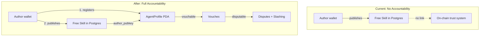

# Close the On-Chain Accountability Gap for Free Skills

## Problem

Free skills published to the Skill Repo exist only in Postgres. The author has no on-chain AgentProfile, which means:

- Nobody can vouch for them (vouches target AgentProfiles)
- Nobody can dispute them (disputes target vouches between AgentProfiles)
- A malicious author faces zero economic consequence

This contradicts the core thesis in [VISION.md](VISION.md): trust must have economic weight behind it.

## Solution

Require authors to have a registered on-chain AgentProfile before they can publish a skill. This connects every skill to an on-chain identity that participates in the vouch/dispute/slash system.

No Solana program changes needed — `register_agent`, `vouch`, `open_dispute`, and `resolve_dispute` already work at the AgentProfile level.




## Changes

### 1. Server-side: Verify AgentProfile in POST /api/skills

File: [web/app/api/skills/route.ts](web/app/api/skills/route.ts)

After wallet signature verification (line ~187), add an on-chain AgentProfile check using the existing `resolveAuthorTrust` from [web/lib/trust.ts](web/lib/trust.ts):

```typescript
const trust = await resolveAuthorTrust(authorPubkey);
if (!trust.isRegistered) {
  return NextResponse.json(
    { error: 'You must register an on-chain AgentProfile before publishing. Go to your Profile tab to register.' },
    { status: 403 }
  );
}
```

This is the authoritative gate — even if the frontend is bypassed, the API enforces registration.

### 2. Client-side: Check profile on the Publish page

File: [web/app/skills/publish/page.tsx](web/app/skills/publish/page.tsx)

- Use the existing `useReputationOracle` hook to call `getAgentProfile(publicKey)` on mount
- If the author has no AgentProfile, show a clear message with a link to register (same pattern used in the Vouch tab at [web/app/page.tsx](web/app/page.tsx) lines 1074-1081)
- Disable the publish button when no profile exists
- This provides immediate feedback rather than waiting for a 403 from the API

The existing `handlePublish` error handling already displays API errors, so the 403 message will show as a fallback if the client-side check is somehow bypassed.

### 3. Inline registration option on the Publish page

Instead of forcing the user to navigate away, offer inline registration directly on the publish page:

- If `!agentProfile && connected`: show a registration prompt with a "Register Now" button
- Use the existing `registerAgent(metadataUri)` from `useReputationOracle`
- After successful registration, auto-refresh the profile check so the user can continue publishing without leaving the page
- The metadata URI can default to empty (it's optional in the program)

This minimizes friction — the user stays on the publish page throughout.

### 4. Update the Publish page disabled state

Currently the publish button disabled condition is:

```
disabled={publishing || !connected || !content || !name || !skillId}
```

Add `!agentProfile` to this condition.

### 5. Competition page: mention registration requirement

File: [web/app/competition/page.tsx](web/app/competition/page.tsx)

In the "How to Enter" steps, add a note that on-chain registration is required before publishing. The publish page handles the actual flow, but the competition page should set expectations.

## What stays the same

- The Solana program — no changes
- The vouch/dispute/slash flow — already works at the AgentProfile level
- The `/api/skills` GET endpoint — still fetches and displays all skills
- The skill detail page — already shows `isRegistered` status via TrustBadge
- Existing published skills from unregistered authors remain accessible (no retroactive enforcement)

## Edge cases

- **Already-published skills from unregistered authors**: These stay in the database. The TrustBadge already shows "Unregistered" for these. No migration needed.
- **RPC failure during AgentProfile check**: If the on-chain lookup fails in the API, return a 503 ("Unable to verify on-chain registration, try again") rather than silently allowing publication.
- **Wallet connected but no SOL for registration**: Registration costs ~0.003 SOL in rent. The competition page already links to faucet.solana.com for devnet SOL.

