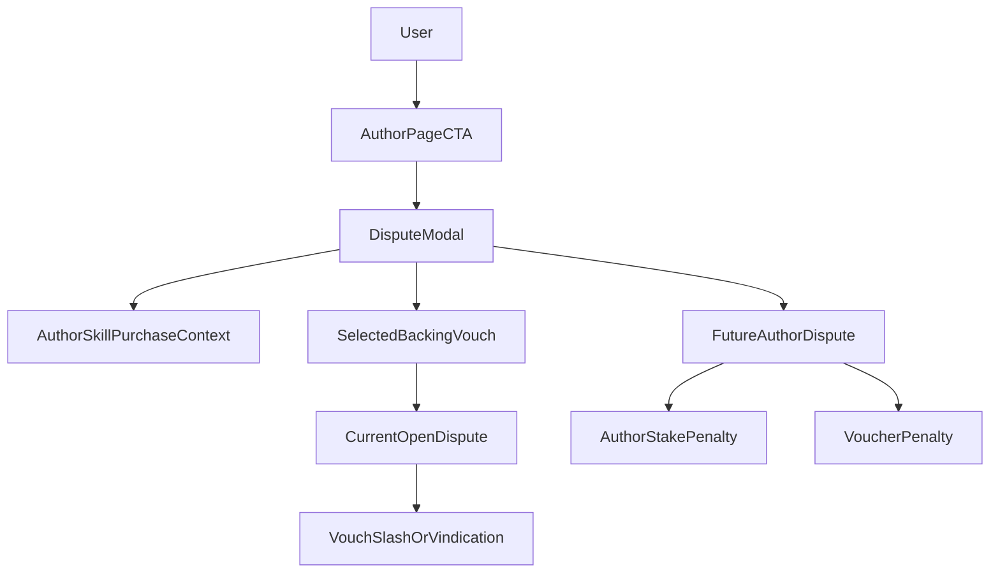

# Clean Dispute Model For AgentVouch

## Recommendation

Use a two-layer model:

- The primary **dispute target** is the `author`, optionally scoped to a specific `skill` or `purchase`.
- The **economic targets** are the bonded positions that backed that author during the relevant period.
- In the short term, that means an author-level CTA can open a dispute against a selected backing `Vouch`, because the current program only disputes vouches.
- In the long term, the protocol should support first-class `AuthorDispute` objects with optional cascading penalties to both the author and implicated vouchers.

Canonical naming:

- Use `dispute` for adversarial challenges.
- Avoid `claim` in dispute UX because it conflicts with revenue claim and withdrawal language.
- Treat the current on-chain `Dispute` account as a `VouchDispute` in product semantics when that distinction matters.

This matches the product intuition:

- Users think in terms of: `This author shipped something malicious.`
- The protocol still needs a slashable object with stake attached.

## What Exists Today

Current on-chain semantics are narrower than the intended UX:

- `[programs/reputation-oracle/src/instructions/open_dispute.rs](/Users/andysustic/Repos/agent-reputation-oracle/programs/reputation-oracle/src/instructions/open_dispute.rs)` only opens a dispute against a `Vouch` PDA.
- `[programs/reputation-oracle/src/state/dispute.rs](/Users/andysustic/Repos/agent-reputation-oracle/programs/reputation-oracle/src/state/dispute.rs)` stores `vouch`, `challenger`, and `evidence_uri`, but no `author`, `skill`, or `purchase` references.
- `[programs/reputation-oracle/src/instructions/resolve_dispute.rs](/Users/andysustic/Repos/agent-reputation-oracle/programs/reputation-oracle/src/instructions/resolve_dispute.rs)` slashes the voucher stake and reduces the vouchee's aggregate trust stats, but it does not slash any author-owned escrow.
- `[web/app/dashboard/page.tsx](/Users/andysustic/Repos/agent-reputation-oracle/web/app/dashboard/page.tsx)` already exposes the raw dispute flow, and it requires a `vouch` address.
- `[web/app/author/[pubkey]/page.tsx](/Users/andysustic/Repos/agent-reputation-oracle/web/app/author/[pubkey]/page.tsx)` has the right discovery context for an author-centric CTA: profile, published skills, and received vouches.

## Clean Product Semantics

The user-facing model should be:

- `Open dispute` against the author.
- The dispute may reference:
  - a specific `skill`
  - an optional `purchase`
  - evidence URI / notes
  - one or more backing vouchers tied to that author
- Resolution should answer two questions separately:
  - Was the author at fault?
  - Should backing vouchers also be penalized for endorsing the author?

That gives clearer protocol meaning:

- **Author liability** covers harmful output, fraud, malicious updates, or failure to deliver.
- **Voucher liability** covers staking trust behind a bad actor.

## Recommended Phasing

This sketch should be read with the updated canonical naming above, even where the Phase 1 implementation originally shipped with softer claim-oriented UX copy.

### Phase 1: CTA And Language Alignment

Do this before any new first-class author dispute primitive:

- Add `Open dispute` to the author page in `[web/app/author/[pubkey]/page.tsx](/Users/andysustic/Repos/agent-reputation-oracle/web/app/author/[pubkey]/page.tsx)`.
- Scope the modal to:
  - dispute reason
  - optional related skill
  - optional evidence URI
  - selected backing voucher
- Reuse the existing wallet flow in `[web/hooks/useReputationOracle.ts](/Users/andysustic/Repos/agent-reputation-oracle/web/hooks/useReputationOracle.ts)` and route the action through `openDispute(vouch, evidenceUri)`.
- Be explicit in copy that the current protocol challenges a backing stake, even though the user is opening a dispute about the author.

Recommended copy:

- CTA: `Open dispute`
- Modal title: `Open dispute against this author`
- Helper text: `This dispute currently challenges a backing voucher tied to this author.`

This preserves the correct product framing without lying about what the chain does today.

### Phase 2: First-Class Author Dispute Primitive

Add a proper author dispute object on-chain:

- New `AuthorDispute` account keyed by author plus dispute id.
- Fields should include:
  - `author`
  - optional `skill_listing`
  - optional `purchase`
  - `challenger`
  - `evidence_uri`
  - `status`
  - `ruling`
  - list of affected vouchers or a linked dispute-to-vouch index
- Keep current `VouchDispute` flows as a lower-level enforcement mechanism, or fold them under author dispute resolution later.

At that point the author page CTA becomes semantically exact instead of a UX wrapper over a vouch dispute.

### Phase 3: Full Economic Model

If AgentVouch wants direct author accountability, add author-bonded stake or escrow:

- Authors post stake when registering or publishing paid skills.
- Successful disputes can slash:
  - author stake first
  - backing vouchers second, if configured
- Trust metrics should then distinguish:
  - `disputes_against_author`
  - `disputes_upheld_against_author`
  - `vouches_slashed`

This avoids overloading current `disputesWon` / `disputesLost` fields in `[programs/reputation-oracle/src/state/agent.rs](/Users/andysustic/Repos/agent-reputation-oracle/programs/reputation-oracle/src/state/agent.rs)`, which today reflect voucher outcomes more than author misconduct.

## Architecture Sketch

## Implementation Notes Before CTA

A few semantics should be tightened first or explicitly documented in the implementation:

- `[programs/reputation-oracle/src/instructions/resolve_dispute.rs](/Users/andysustic/Repos/agent-reputation-oracle/programs/reputation-oracle/src/instructions/resolve_dispute.rs)` sets `Vindicate` back to `VouchStatus::Active`; if that is intended, the UI should not imply a separate persistent vindicated state.
- `[ARCHITECTURE.md](/Users/andysustic/Repos/agent-reputation-oracle/ARCHITECTURE.md)` says vindication gives the bond to the voucher, but the current code does not transfer that bond. That doc/code drift should be resolved before dispute copy becomes more prominent.
- The author page should expose the underlying `vouch` PDA for each received voucher row so the author dispute modal can target a real on-chain object.

## Suggested Next Move

Proceed with a Phase 1 author-page CTA only:

- keep the product wording author-centric and dispute-based
- keep the execution vouch-centric
- defer protocol expansion until we decide whether authors themselves must bond stake

That gives a usable UX now without pretending the current program supports author-native disputes yet.