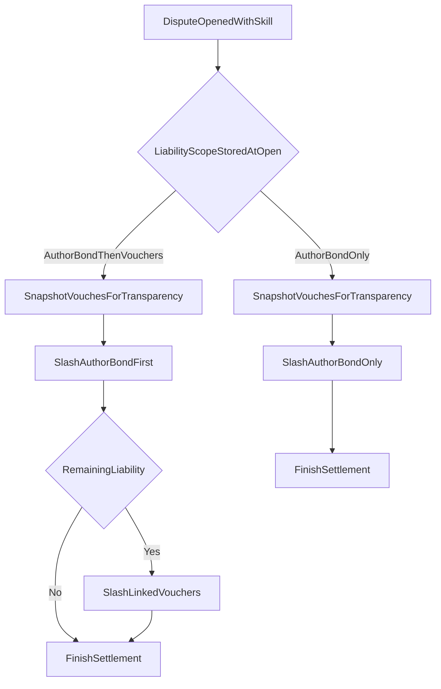

# Free Skill Liability Plan

## Policy Decisions
- Every `AuthorDispute` must reference a `skill_listing`.
- `purchase` remains optional, but when present it must match the referenced listing.
- Free-skill disputes still snapshot/link backing vouchers for transparency.
- Free-skill disputes never slash vouchers; upheld liability is capped at `AuthorBond`.
- Paid-skill disputes keep current settlement order: `AuthorBond` first, then linked vouchers.

## Protocol Changes
- Update [programs/reputation-oracle/src/state/author_dispute.rs](programs/reputation-oracle/src/state/author_dispute.rs) to persist settlement mode and listing-price evidence:
  - Add `AuthorDisputeLiabilityScope` enum with `AuthorBondOnly` and `AuthorBondThenVouchers`.
  - Replace optional `skill_listing` with required `Pubkey`.
  - Add `skill_price_lamports_snapshot: u64` so resolve-time behavior cannot be changed by later listing edits.
- Update [programs/reputation-oracle/src/instructions/open_author_dispute.rs](programs/reputation-oracle/src/instructions/open_author_dispute.rs):
  - Require `skill_listing` for all disputes.
  - Validate `purchase` against the required listing when supplied.
  - Always create voucher-link snapshots for transparency.
  - Derive and store `liability_scope` from the listing price at open time.
- Update [programs/reputation-oracle/src/instructions/resolve_author_dispute.rs](programs/reputation-oracle/src/instructions/resolve_author_dispute.rs):
  - Branch settlement on stored `liability_scope`.
  - `AuthorBondOnly`: validate snapshot completeness, slash only `AuthorBond`, emit `voucher_slashed_amount = 0`.
  - `AuthorBondThenVouchers`: keep the current `AuthorBond -> vouchers` flow.
- Update [programs/reputation-oracle/src/events.rs](programs/reputation-oracle/src/events.rs) so dispute open/resolve events include `liability_scope`, `skill_price_lamports_snapshot`, and explicit voucher slash amount.

## Client And Read Model
- Regenerate [web/reputation_oracle.json](web/reputation_oracle.json) and [web/generated/reputation-oracle/src/generated](web/generated/reputation-oracle/src/generated).
- Update [web/hooks/useReputationOracle.ts](web/hooks/useReputationOracle.ts):
  - Always require a `skillListing` when opening disputes.
  - Keep voucher snapshot account gathering for both free and paid skill disputes.
  - Expose `liabilityScope` and `skillPriceLamportsSnapshot` from returned dispute records.
- Update [web/lib/authorDisputes.ts](web/lib/authorDisputes.ts), [web/lib/trust.ts](web/lib/trust.ts), [web/app/api/author/[pubkey]/route.ts](web/app/api/author/[pubkey]/route.ts), and [web/app/api/agents/[pubkey]/trust/route.ts](web/app/api/agents/[pubkey]/trust/route.ts):
  - Preserve current aggregate trust metrics.
  - Add per-dispute liability metadata so API consumers can tell free-skill disputes from paid-skill disputes.
  - Clarify that `totalStakeAtRisk` is aggregate author exposure, not the slash path for every dispute.

## UI And Docs
- Update [web/app/author/[pubkey]/page.tsx](web/app/author/[pubkey]/page.tsx) and [web/app/dashboard/page.tsx](web/app/dashboard/page.tsx) to explain:
  - every report is tied to a skill,
  - free-skill disputes snapshot vouchers but cap liability at `AuthorBond`,
  - paid-skill disputes may continue into vouchers after `AuthorBond`.
- Update [web/components/TrustBadge.tsx](web/components/TrustBadge.tsx) and skill-listing surfaces in [web/app/skills/[id]/page.tsx](web/app/skills/[id]/page.tsx) and [web/app/skills/publish/page.tsx](web/app/skills/publish/page.tsx) to avoid implying vouchers are always slashable.
- Update [docs/ARCHITECTURE.md](docs/ARCHITECTURE.md), [docs/AUTHORBOND_VS_SELFVOUCH.md](docs/AUTHORBOND_VS_SELFVOUCH.md), and [web/public/skill.md](web/public/skill.md) to document the free-vs-paid dispute split.

## Settlement Flow

## Verification
- Extend [tests/author-disputes.ts](tests/author-disputes.ts) for:
  - free-skill dispute open/resolve with voucher snapshot but zero voucher slashing,
  - paid-skill dispute open/resolve with current slash ordering,
  - failure when opening a dispute without `skill_listing`,
  - failure when `purchase` does not match the disputed listing,
  - proof that changing listing price after dispute open does not change settlement mode.
- Run `anchor build`, sync IDL/client artifacts, run Anchor tests, targeted web tests, and `npm run build` in `web/`.