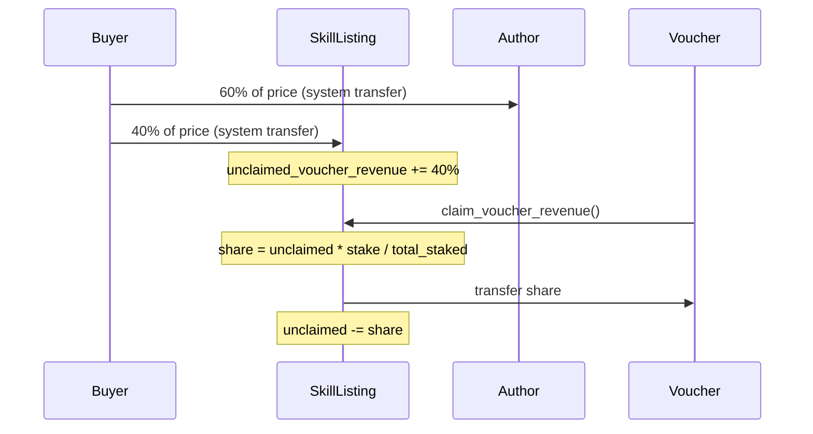

# Phase 0: Fix v1 Revenue Gap + Add Anchor Events

## The Problem

`purchase_skill` calculates a 40% voucher pool but only transfers 60% to the author. The remaining 40% **stays in the buyer's wallet** — it's never collected. `cumulative_revenue` on Vouch is never written. There's no claim instruction. Events are `msg!` only.

## Design Decisions

### Where does the 40% go?

The 40% voucher pool needs to be held on-chain until claimed. Two options:

1. **SkillListing account holds it** — simplest, but the SkillListing PDA already exists and adding lamports to it is trivial via a second `system_program::transfer`. Track `unclaimed_voucher_revenue: u64` on SkillListing.
2. **Separate vault PDA per skill** — cleaner separation but adds account creation overhead for every skill listing.

**Decision: Option 1.** The SkillListing already exists, already tracks `total_revenue`. We add `unclaimed_voucher_revenue` to track how much is claimable, and the lamports sit in the SkillListing account itself. This avoids new PDAs and keeps the change minimal.

### How does claiming work?

A voucher who has an active vouch for the skill's author can call `claim_voucher_revenue`. Their share is proportional to their `stake_amount` relative to the author's `total_staked_for`. The claim debits lamports from the SkillListing account and credits the voucher.

```
voucher_share = skill.unclaimed_voucher_revenue * vouch.stake_amount / author.total_staked_for
```

We update `vouch.cumulative_revenue += voucher_share` and `vouch.last_payout_at = now` for tracking. We update `skill.unclaimed_voucher_revenue -= voucher_share` to prevent double-claiming.

**Edge case**: If `total_staked_for == 0` (no active vouches), the 40% accumulates in the SkillListing. It becomes claimable once someone vouches. This is acceptable — it incentivizes vouching.

### Claim granularity

A voucher claims per-skill, not globally. This keeps the instruction simple (one skill listing + one vouch account per call). Bulk claiming can be done client-side with multiple instructions in one transaction.

## Data Flow




## Files Changed

### Program changes (Rust)

- **[programs/reputation-oracle/src/state/skill_listing.rs](programs/reputation-oracle/src/state/skill_listing.rs)** — Add `unclaimed_voucher_revenue: u64` field to `SkillListing`. Update `SPACE` constant (+8 bytes).
- **[programs/reputation-oracle/src/instructions/purchase_skill.rs](programs/reputation-oracle/src/instructions/purchase_skill.rs)** — Add second `system_program::transfer` to send 40% to skill_listing account. Set `skill_listing.unclaimed_voucher_revenue += voucher_pool`. Replace `msg!` with `emit!`.
- **New: [programs/reputation-oracle/src/instructions/claim_voucher_revenue.rs](programs/reputation-oracle/src/instructions/claim_voucher_revenue.rs)** — New instruction. Accounts: `skill_listing` (mut), `vouch` (mut), `author_profile`, `voucher` (signer, mut). Computes proportional share, transfers lamports from skill_listing to voucher, updates `vouch.cumulative_revenue` and `skill.unclaimed_voucher_revenue`.
- **[programs/reputation-oracle/src/instructions/mod.rs](programs/reputation-oracle/src/instructions/mod.rs)** — Add `pub mod claim_voucher_revenue` + re-export.
- **[programs/reputation-oracle/src/lib.rs](programs/reputation-oracle/src/lib.rs)** — Add `claim_voucher_revenue` entry point.
- **New: [programs/reputation-oracle/src/events.rs](programs/reputation-oracle/src/events.rs)** — Define Anchor `#[event]` structs: `VouchCreated`, `VouchRevoked`, `DisputeOpened`, `DisputeResolved`, `SkillPurchased`, `RevenueClaimed`, `SkillListingCreated`.
- **All instruction files** — Replace `msg!` calls with `emit!` calls using the new event structs.

### Account schema note

Adding `unclaimed_voucher_revenue` to `SkillListing` changes the account size. **Existing skill listings on devnet will need reallocation or redeployment.** Since we're on devnet and this is pre-mainnet, a clean redeploy is acceptable. Document this in the migration section.

### Test changes (TypeScript)

- **[tests/marketplace.test.ts](tests/marketplace.test.ts)** — Extend the existing purchase test to also verify the 40% lands in the SkillListing account. Add new test: vouch for author -> purchase skill -> claim revenue -> verify voucher received correct share and `cumulative_revenue` updated.
- **[tests/reputation-oracle.ts](tests/reputation-oracle.ts)** — No changes needed (reputation/dispute flows are untouched).

### Constraints / validation on `claim_voucher_revenue`

- Vouch must be `Active` or `Vindicated` (not `Revoked`, `Slashed`, or `Disputed`)
- `vouch.vouchee` must match the author's agent profile
- `author_profile.total_staked_for > 0` (prevent division by zero)
- `skill_listing.unclaimed_voucher_revenue > 0` (nothing to claim)
- Voucher must be the signer and match `vouch.voucher`'s authority

