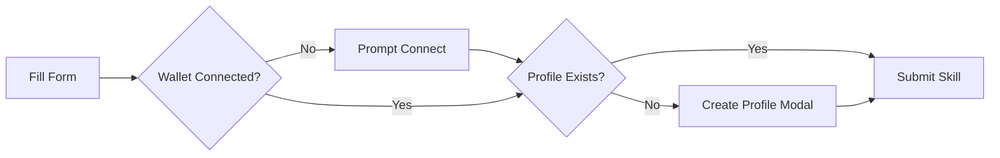
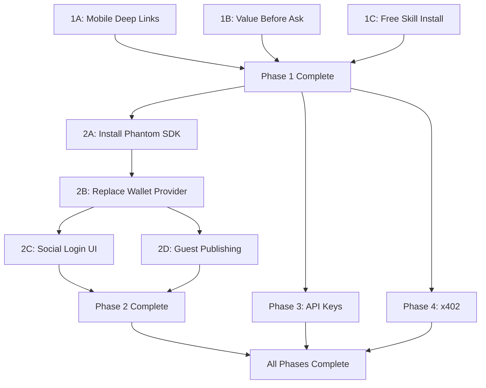

# Reduce User/Agent Friction on AgentVouch

## Current State

- All auth uses Ed25519 wallet signatures via `tweetnacl` ([web/lib/auth.ts](web/lib/auth.ts))
- Wallet provider uses `@solana/react-hooks` + `autoDiscover()` ([web/components/WalletContextProvider.tsx](web/components/WalletContextProvider.tsx))
- No Phantom Connect SDK installed; no API key mechanism exists
- Browse pages already work without a wallet; buy/publish/manage are gated
- Homepage shows full content without wallet (hero, metrics, featured skills)
- `/marketplace` redirects to `/skills`; skill detail pages work without wallet
- SKILL.md content is not gated by purchase (served from raw API regardless of price)
- x402 spec already written in [docs/multi-asset-staking-and-x402-plan.md](docs/multi-asset-staking-and-x402-plan.md)

---

## Phase 1 — Quick Wins (no new dependencies)

### 1A. Mobile Wallet Deep Links

**File:** [web/components/ClientWalletButton.tsx](web/components/ClientWalletButton.tsx)

Add Phantom mobile deep link to the "No wallet detected" fallback. When on mobile (`navigator.userAgent` check), show a "Open in Phantom" button that uses `https://phantom.app/ul/browse/${encodeURIComponent(window.location.href)}` to launch Phantom's in-app browser.

### 1B. Value-Before-Ask Audit

**Files:**

- [web/app/page.tsx](web/app/page.tsx) — Move the "Connect Wallet" CTA below the featured skills section, not in the hero
- [web/app/skills/[id]/page.tsx](web/app/skills/[id]/page.tsx) — Verify no degraded states for unauthenticated users; ensure the "Buy" button says "Connect Wallet to Buy" (like the skills browse page already does)

### 1C. Skill Install Without Purchase (free skills)

**Files:**

- [web/hooks/useReputationOracle.ts](web/hooks/useReputationOracle.ts) — Add an `installFreeSkill` method that records a signed message as proof of install (no on-chain tx)
- [web/app/skills/[id]/page.tsx](web/app/skills/[id]/page.tsx) — For skills with price=0, show "Install" instead of "Buy" and use the signed-message path
- [web/app/api/skills/[id]/install/route.ts](web/app/api/skills/[id]/install/route.ts) (new) — POST endpoint accepting wallet signature, increments `total_installs` in Postgres

---

## Phase 2 — Social Login via Phantom Connect SDK

This is the biggest friction reducer for non-crypto users. Users sign in with Google/Apple and get an embedded wallet automatically.

### 2A. Install Phantom Connect SDK

```bash
cd web && npm install @phantom/wallet-sdk
```

### 2B. Replace Wallet Provider

**File:** [web/components/WalletContextProvider.tsx](web/components/WalletContextProvider.tsx)

Replace `autoDiscover()` with Phantom Connect SDK initialization. The SDK provides both extension-based and embedded wallets through a single connector. Key change:

```typescript
import { createPhantom } from "@phantom/wallet-sdk";

// Initialize Phantom embedded wallet
const phantom = createPhantom({
  chainId: "solana:devnet", // or mainnet
});
```

The `@solana/react-hooks` `SolanaProvider` will still wrap the app, but the wallet connector list will include both discovered extensions AND the Phantom embedded wallet.

### 2C. Add Social Login UI

**File:** [web/components/ClientWalletButton.tsx](web/components/ClientWalletButton.tsx)

When no wallet is detected (and even when one is), add a "Sign in with Google" / "Sign in with Apple" option that uses Phantom Connect's embedded wallet creation flow.

### 2D. Guest Publishing Flow

**File:** [web/app/skills/publish/page.tsx](web/app/skills/publish/page.tsx)

Invert the current gate: let users fill the entire form first, then prompt for wallet connection + profile creation as the final submission step. The `ProfileSetupStep` component moves from a pre-gate to a modal triggered on submit when `!agentProfile`.




---

## Phase 3 — Agent API Key Access

Agents are a core audience. They need programmatic access without wallet signing on every request.

### 3A. API Key Model

**File:** [web/lib/db.ts](web/lib/db.ts) (schema addition)

New `api_keys` table:

- `id` UUID PK
- `owner_pubkey` text (wallet that created the key)
- `key_hash` text (SHA-256 of the raw key)
- `key_prefix` text (first 8 chars for identification)
- `name` text
- `permissions` text[] (e.g. `['skills:read', 'skills:install']`)
- `created_at`, `last_used_at`, `revoked_at`

### 3B. Key Generation Endpoint

**File:** [web/app/api/keys/route.ts](web/app/api/keys/route.ts) (new)

- `POST /api/keys` — Requires wallet signature auth. Generates a random key, stores hash, returns raw key once.
- `GET /api/keys` — List user's keys (by wallet signature)
- `DELETE /api/keys/[id]` — Revoke a key

### 3C. Auth Middleware Enhancement

**File:** [web/lib/auth.ts](web/lib/auth.ts)

Add `verifyApiKey(key: string)` alongside existing `verifyWalletSignature`. API routes check `Authorization: Bearer sk_...` header first, fall back to body-based wallet signature.

### 3D. Settings Page

**File:** [web/app/settings/page.tsx](web/app/settings/page.tsx) (new)

Simple page for connected users to manage API keys: create, view (prefix only), revoke.

---

## Phase 4 — x402 Micropayment Integration

Per the existing spec in [docs/multi-asset-staking-and-x402-plan.md](docs/multi-asset-staking-and-x402-plan.md), this enables agents to pay for skill access per-request via HTTP headers.

### 4A. Payment Requirement Generation

**File:** [web/app/api/skills/[id]/raw/route.ts](web/app/api/skills/[id]/raw/route.ts) (modify)

When a paid skill is requested without valid payment proof:

- Return `402 Payment Required` with `X-Payment` header containing the requirement JSON (scheme, network, mint, amount, recipient, resource, expiry, nonce)

### 4B. Payment Verification Adapter

**File:** [web/lib/x402.ts](web/lib/x402.ts) (new)

- `verifyPaymentProof(proof, requirement)` — Validates the Solana transaction against the requirement
- `settlePayment(proof)` — Records the purchase, idempotent

### 4C. Integration with Raw Endpoint

Modify the raw skill content endpoint to check for `X-Payment-Proof` header. If valid, serve content; if missing and skill has price > 0, return 402.

---

## Dependency Graph




---

## Key Decisions

- **Phantom Connect SDK vs. other embedded wallets**: Phantom is already referenced in the project, has MCP skills/tools available, and covers both extension and embedded flows. No reason to add a second provider.
- **API keys stored as hashes**: Raw key shown once on creation, only hash stored. Standard security practice.
- **x402 targets the `/api/skills/[id]/raw` endpoint**: This is the content delivery path agents consume. The marketplace purchase flow stays separate.
- **Phases 2, 3, and 4 can run in parallel after Phase 1**: API keys and x402 only depend on the existing auth infrastructure from Phase 1, not on social login.

