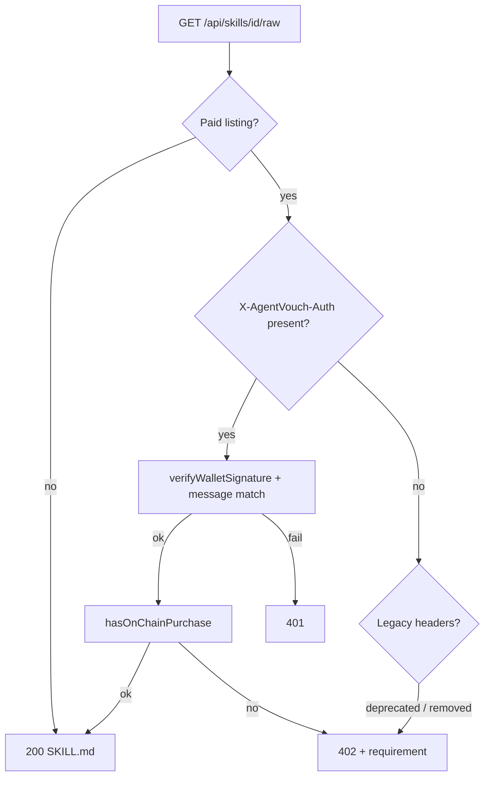

# Signed download for paid skill raw content

## Problem

`[web/app/api/skills/[id]/raw/route.ts](web/app/api/skills/[id]/raw/route.ts)` currently allows paid downloads via `?buyer=` and `X-Payment-Proof` with only an on-chain PDA check—**no proof the HTTP client controls that pubkey**. Anyone who knows a purchaser’s address can fetch the markdown.

## Target behavior

For **paid** listings (`on_chain_address` + `getOnChainPrice` price > 0), grant `200` only when:

1. The client presents a verifiable **wallet signature** over a **server-reconstructible** message that scopes the request to this skill + listing + time window.
2. `hasOnChainPurchase(verifiedPubkey, skill.on_chain_address)` is true.

Unpaid / free paths stay unchanged (direct markdown, install counter).




## Canonical message format

Add a builder in `[web/lib/auth.ts](web/lib/auth.ts)` next to `buildSignMessage`:

```text
AgentVouch Skill Download
Action: download-raw
Skill id: {id}
Listing: {on_chain_address_base58}
Timestamp: {unix_ms}
```

- `{id}` = URL path segment exactly as in the request (UUID today; aligns with `[web/app/api/skills/[id]/install/route.ts](web/app/api/skills/[id]/install/route.ts)` if raw is later extended for `chain-` ids).
- `{on_chain_address_base58}` = `skills.on_chain_address` from the row used to serve content.
- `{unix_ms}` must equal `AuthPayload.timestamp` (same invariant as publish/install).

Verification steps (server):

1. Parse header → `AuthPayload` (see below).
2. `verifyWalletSignature(payload)` (`[web/lib/auth.ts](web/lib/auth.ts)`, existing 5-minute window).
3. Strict string equality: `payload.message === buildDownloadRawMessage(id, listing, payload.timestamp)` (normalize newlines to `\n` only).
4. `hasOnChainPurchase(payload.pubkey!, listing)` (use pubkey from verification result, not blindly from client).

## Client encoding: `X-AgentVouch-Auth`

- **Header value**: JSON string of `AuthPayload` (`pubkey`, `signature` base64, `message`, `timestamp`), same shape as install/publish bodies.
- **curl**: pass with `-H 'X-AgentVouch-Auth: {"pubkey":"...",...}'` (escape quotes) or document a one-liner that base64-encodes the JSON if shell quoting is painful—optional doc nicety, not required for v1.

No POST body required for v1 (keeps single GET + attachment semantics).

## Route changes (`[web/app/api/skills/[id]/raw/route.ts](web/app/api/skills/[id]/raw/route.ts)`)

**Paid branch order:**

1. If `X-AgentVouch-Auth` present → parse, verify signature + message scope → `hasOnChainPurchase` → success path (increment installs, return markdown) or `401` / `402` with clear JSON errors.
2. **Remove** the `?buyer=` branch entirely (fixes the impersonation hole).
3. `**X-Payment-Proof`**: remove for paid downloads as well (same hole as `?buyer=`). Agents that relied on it should switch to signed auth. If you need a deprecation period, ship one release with `403` + explicit `"error":"Use X-AgentVouch-Auth"` when old headers are sent—optional; plan assumes clean removal unless you prefer a soft migration.
4. Update the `402` JSON `message` field to describe: purchase on-chain, then retry with `X-AgentVouch-Auth` and point to docs for the exact message template.

Keep `generatePaymentRequirement` / `X-Payment` header on `402` unchanged for the **payment instruction** half of x402.

## Tests (`[web/__tests__/api/skills-raw.test.ts](web/__tests__/api/skills-raw.test.ts)`)

- Mock `@/lib/auth` `verifyWalletSignature` (and import `buildDownloadRawMessage` for expected message in assertions).
- Add cases: valid signed path → 200; bad signature → 401; wrong message (wrong listing/id) → 401; valid sig but no PDA → 402.
- Remove tests that cover `?buyer=` and `X-Payment-Proof` success for paid skills; optionally one test that legacy headers no longer bypass payment (402 or 401).

## Docs and UI copy

- `[web/public/skill.md](web/public/skill.md)`: Replace `?buyer=` / `X-Payment-Proof` instructions with signed-download steps (message template, header name, minimal curl example).
- `[web/app/docs/page.tsx](web/app/docs/page.tsx)`: Update the generic `curl .../raw` line to note paid skills need signature (or link to skill.md section).
- `[web/app/skills/[id]/page.tsx](web/app/skills/[id]/page.tsx)`: Any “copy API URL” or install snippet for `/raw` should mention that **after purchase**, clients must sign the download message (short note + link to docs).

## Out of scope (explicit)

- **Chain-only skill IDs** (`chain-...`): `[web/app/api/skills/[id]/raw/route.ts](web/app/api/skills/[id]/raw/route.ts)` currently only resolves Postgres UUIDs; install handles `chain-` separately. Signed download can use the same message format once raw supports chain ids; no change required in this plan unless you choose to extend raw in the same PR.
- **Nonce store / Redis**: optional later hardening from the sketch; v1 relies on listing-bound message + 5-minute TTL + HTTPS.

## Verification

- `npx vitest run __tests__/api/skills-raw.test.ts`
- `npm run build` in `web/`

