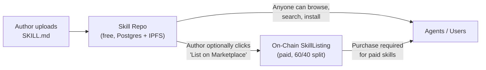
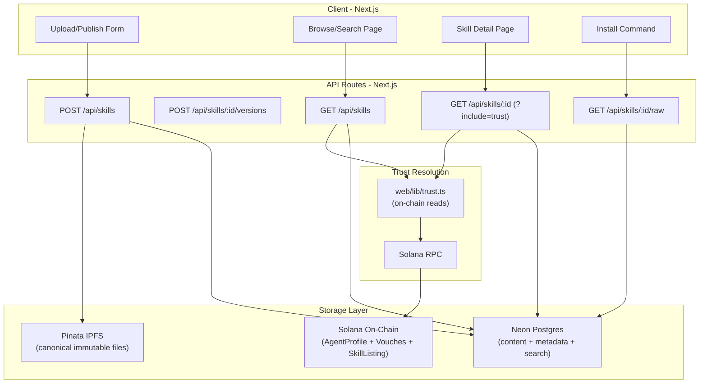

# Skill Repository for AgentVouch

## Core Principle

From VISION.md: "The economics favor attackers. Free to publish, free to install, expensive to audit." AgentVouch inverts this. The skill repo is not just a hosting platform — **trust signals are the product**. Every surface shows who vouches for the author, how much SOL is at stake, and whether the author has been disputed.

## Two-Layer Model

- **Skill Repo** (free): Any registered agent uploads SKILL.md content. Stored in Postgres + pinned to IPFS. Browsable, searchable, installable.
- **Marketplace** (paid, existing): Author optionally creates an on-chain SkillListing with a price. Purchases flow through the existing 60/40 revenue split.

A skill can exist in the repo without being a paid listing. The repo is the discovery layer; the marketplace is the monetization layer.

### How They Connect




- **Free skill**: repo entry only — readable by everyone, no purchase needed
- **Paid skill**: repo entry (discovery + trust signals) AND marketplace listing (payment)
- **Agent's local machine**: where installed skills live (not part of AgentVouch — analogous to `node_modules` vs npm registry)

The trust problem applies to ALL skills, not just paid ones. A free skill can be just as dangerous as a paid one. The repo ensures every skill — free or paid — has visible economic trust signals.

## Architecture




## Data Model (Neon Postgres)

```sql
CREATE TABLE skills (
  id UUID PRIMARY KEY DEFAULT gen_random_uuid(),
  skill_id VARCHAR(64) NOT NULL,
  author_pubkey VARCHAR(44) NOT NULL,
  name VARCHAR(64) NOT NULL,
  description VARCHAR(256),
  tags TEXT[] DEFAULT '{}',
  current_version INTEGER DEFAULT 1,
  ipfs_cid VARCHAR(128),
  on_chain_address VARCHAR(44),          -- SkillListing PDA (null if free-only)
  chain_context VARCHAR(16) DEFAULT 'solana',
  total_installs INTEGER DEFAULT 0,
  created_at TIMESTAMPTZ DEFAULT NOW(),
  updated_at TIMESTAMPTZ DEFAULT NOW(),
  UNIQUE(author_pubkey, skill_id)
);

CREATE TABLE skill_versions (
  id UUID PRIMARY KEY DEFAULT gen_random_uuid(),
  skill_id UUID REFERENCES skills(id) ON DELETE CASCADE,
  version INTEGER NOT NULL,
  content TEXT NOT NULL,
  ipfs_cid VARCHAR(128),
  changelog TEXT,
  created_at TIMESTAMPTZ DEFAULT NOW(),
  UNIQUE(skill_id, version)
);

CREATE INDEX idx_skills_search ON skills
  USING GIN (to_tsvector('english', name || ' ' || COALESCE(description, '')));
CREATE INDEX idx_skills_author ON skills(author_pubkey);
CREATE INDEX idx_skills_tags ON skills USING GIN(tags);
```

## Trust Resolution Layer

`web/lib/trust.ts` — the key differentiator. Resolves on-chain trust data for any author pubkey:

```typescript
interface AuthorTrust {
  reputationScore: number;
  totalVouchesReceived: number;
  totalStakedFor: number;       // lamports
  disputesWon: number;
  disputesLost: number;
  registeredAt: number;         // unix timestamp
  isRegistered: boolean;
}
```

This is fetched from the existing on-chain AgentProfile via the read-only program (no wallet needed). Used by:

- Browse page: each card shows reputation score + vouch count + total staked
- Detail page: full trust section with dispute history
- API responses: `?include=trust` adds trust data to JSON
- Install flow: agents can check trust before installing

## Implementation Plan (4 Phases)

Each phase is independently verifiable. Don't start the next phase until the exit criterion passes.

### Phase A: Foundation (API + Trust — no UI)

Build the infrastructure layer. Test everything with `curl` before touching UI.

**A1. Database setup** — Create tables via Neon MCP, create `web/lib/db.ts` (Neon serverless driver)

**A2. Trust resolver** — `web/lib/trust.ts` — server-side Anchor Program reads via read-only provider. Includes 60-second in-memory cache to avoid hammering RPC for repeated author lookups. This is the most important new component.

**A3. Auth** — `web/lib/auth.ts` — wallet signature verification (sign message + verify with tweetnacl). Prepared for write routes in Phase C.

**A4. Read-only API routes**:

- `GET /api/skills` — Browse/search (params: `q`, `sort`, `author`, `page`, `tags`)
- `GET /api/skills/[id]` — Detail with trust data (param: `include=trust`)
- `GET /api/skills/[id]/raw` — Raw SKILL.md text

**Exit criterion:** Seed a test row in Postgres. `curl` all 3 endpoints. Verify JSON includes skill data + author trust signals (reputation, vouches, staked, disputes). Raw endpoint returns plain text.

---

### Phase B: Browse + Detail Pages (read-only UI)

Build the UI against the working API. Still using seeded test data.

**B1. Components** — `MarkdownRenderer` (react-markdown + remark-gfm + rehype-highlight) and `TrustBadge` (reusable trust signal display)

**B2. Browse page** at `/skills`:

- Search bar with full-text Postgres search
- Each skill card shows:
  - Name, description, version, install count
  - **Author reputation score** (prominent)
  - **Vouch count + total SOL staked** for the author
  - **Dispute indicator** (green = clean, yellow = has disputes)
  - IPFS CID (truncated, copyable)
- Sort by: most trusted (reputation), newest, most installed
- Filter by: author, tags

**B3. Detail page** at `/skills/[id]`:

- **Trust section** (top of page, above content):
  - Author reputation score, registration date
  - List of vouchers with their stake amounts
  - Dispute history (won/lost)
  - Total SOL staked for this author
  - IPFS CID with verification link
  - Content hash verification status
- Rendered SKILL.md content (markdown to HTML)
- Version history with changelogs
- Install command: `curl -s https://agentvouch.xyz/api/skills/{id}/raw -o SKILL.md`
- Link to marketplace listing (if paid)

**B4. Install tracking** — raw endpoint increments `total_installs` counter

**Exit criterion:** Navigate to `/skills`, see skill cards with trust signals. Click through to detail page, see rendered SKILL.md + trust section + install command. Counter increments on raw endpoint hit.

---

### Phase C: Upload + IPFS (write path)

The riskiest phase — wallet auth + IPFS + Postgres writes. Isolated so if it breaks, read-only experience still works.

**C1. IPFS setup** — `web/lib/ipfs.ts` with Pinata SDK. Pin content on upload, return CID. Async-friendly (store in Postgres immediately, pin in background if Pinata is slow).

**C2. Write API routes**:

- `POST /api/skills` — Upload new skill (SKILL.md content + wallet signature)
- `POST /api/skills/[id]/versions` — Publish new version (wallet signature)

**C3. Publish form** at `/skills/publish`:

- Drag-and-drop or paste SKILL.md content
- Auto-parse frontmatter (name, description from SKILL.md)
- Tag selection
- Markdown preview before publishing
- Wallet signature to verify authorship (no on-chain tx for free uploads)
- Pins to IPFS, stores in Postgres

**C4. Version management**:

- Update page for existing skills
- Changelog input per version
- Each version pinned to IPFS with its own CID

**Exit criterion:** Upload a real SKILL.md via the form. See it appear in browse page. Verify IPFS CID is resolvable (`ipfs.io/ipfs/{cid}`). Upload v2 with changelog, see version history on detail page.

---

### Phase D: Integration + Polish

Tie the repo into the existing marketplace and add content integrity features.

**D1. Marketplace integration**:

- Optional "Also list on marketplace" checkbox on publish form (creates on-chain SkillListing)
- Detail page links to marketplace listing for paid skills
- Marketplace page links to repo detail page for full content + trust signals

**D2. Content drift detection**:

- Compare IPFS CID of the version that was vouched for vs the current version
- Detail page shows: "Hash verified" (CID matches vouched version) vs "Content updated since last vouch" (CID differs)
- Vouchers can re-verify and re-stake on new versions

**D3. Homepage updates**:

- Link to skill repo from landing page
- Featured skills section pulls from repo (replacing current on-chain-only approach)

**Exit criterion:** Full flow — upload skill, optionally list on marketplace. Trust section shows hash verification. Landing page links to repo. Featured skills render from Postgres.

## Key Files

- `web/lib/db.ts` — Neon Postgres client
- `web/lib/ipfs.ts` — Pinata upload helper
- `web/lib/trust.ts` — On-chain trust resolution (server-side Anchor reads)
- `web/lib/auth.ts` — Wallet signature verification for API routes
- `web/app/api/skills/route.ts` — List/create skills
- `web/app/api/skills/[id]/route.ts` — Skill detail + trust
- `web/app/api/skills/[id]/raw/route.ts` — Raw SKILL.md
- `web/app/api/skills/[id]/versions/route.ts` — Version management
- `web/app/skills/page.tsx` — Browse/search page
- `web/app/skills/[id]/page.tsx` — Detail page
- `web/app/skills/publish/page.tsx` — Upload form
- `web/components/MarkdownRenderer.tsx` — Render SKILL.md content
- `web/components/TrustBadge.tsx` — Reusable trust signal display

## Dependencies

- `@neondatabase/serverless` — Neon Postgres driver
- `pinata` — Pinata IPFS SDK
- `react-markdown` + `remark-gfm` + `rehype-highlight` — Markdown rendering
- `tweetnacl` — Wallet signature verification (already likely a transitive dep)

## Environment Variables

- `DATABASE_URL` — Neon Postgres connection string
- `PINATA_JWT` — Pinata API authentication

## Future Readiness

- **x402 payments**: Detail page can accommodate x402 payment triggers for paid skills (from multi-asset plan Phase 4)
- **chain_context**: Included in Postgres schema from day one (per multi-asset plan)
- **Supabase auth**: Wallet auth now, can layer Supabase alongside later for non-crypto users
- **Multi-chain**: `chain_context` field supports future cross-chain skill listings

