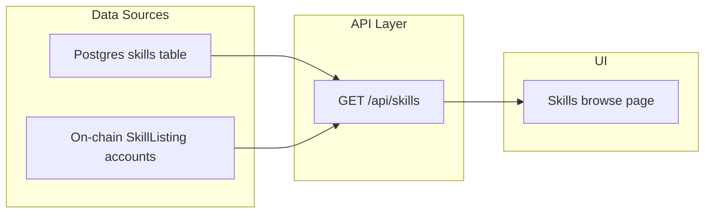

# Unified Skill Browse: Merge Marketplace into Repo

## Problem

The Skill Repository (`/skills`) only shows Postgres skills, and the Marketplace (`/marketplace`) only shows on-chain listings. Users see two disconnected catalogs.

## Approach

Add a new API endpoint that merges both data sources server-side, deduplicating by author + skill name. The browse page calls this unified endpoint instead of the current Postgres-only one.

## Key decisions

- **Merge happens in the API route** (`GET /api/skills`), not client-side — keeps the browse page simple
- **Dedup strategy**: match by `author_pubkey + name` (case-insensitive). If a skill exists in both, Postgres wins (has richer data), but we attach the on-chain price/revenue/downloads
- **On-chain-only listings** get normalized into the same `SkillRow` shape with `source: 'chain'` so the UI can show a price badge
- **Trust signals** still resolved for all authors via existing `resolveMultipleAuthorTrust`

## Changes

### 1. Update `GET /api/skills` in [web/app/api/skills/route.ts](web/app/api/skills/route.ts)

- Import `Connection`, `Program`, `AnchorProvider` and IDL (same pattern as [web/lib/trust.ts](web/lib/trust.ts))
- After fetching from Postgres, also fetch on-chain `SkillListing.all()` via a read-only program
- Normalize on-chain listings into the `SkillRow` shape:
  - `id` = public key string (prefixed with `chain-` to distinguish)
  - `author_pubkey` = `listing.account.author.toBase58()`
  - `name` = `listing.account.name`
  - `description` = `listing.account.description`
  - `price_lamports` = from on-chain data (new field, null for repo-only skills)
  - `total_downloads` = from on-chain data
  - `on_chain_address` = listing public key
- Deduplicate: if Postgres skill matches an on-chain listing (same author + name), enrich the Postgres entry with `price_lamports`, `on_chain_address`, `total_downloads`
- Append remaining on-chain-only listings to the results
- Apply sort/search/filter across the merged set

### 2. Update `SkillRow` interface in [web/app/skills/page.tsx](web/app/skills/page.tsx)

- Add optional fields: `price_lamports?: number`, `source?: 'repo' | 'chain'`, `total_downloads?: number`

### 3. Update skill card rendering in [web/app/skills/page.tsx](web/app/skills/page.tsx)

- If `price_lamports > 0`, show a price badge (e.g., "0.10 SOL") on the card
- If `source === 'chain'` (on-chain only, not in repo), link to `/marketplace` instead of `/skills/[id]`
- Show download count from on-chain data when available

### 4. Add a "Sort by: most trusted" option

- The plan spec called for sorting by reputation. Add `sort=trusted` which orders by `author_trust.reputationScore` descending after the merge.

## What stays the same

- `/marketplace` page unchanged — it keeps its purchase/publish/my-listings functionality
- `/skills/[id]` detail page unchanged — only works for Postgres-backed skills
- Write routes unchanged

## Next steps: on-chain accountability gap

After this plan is complete, create a dedicated plan to close the accountability gap for free skills:

- Free repo-only skills currently can't be vouched or disputed — no on-chain account to target
- A malicious free skill author can't be slashed, which contradicts the core VISION.md thesis ("the economics favor attackers — free to publish, free to install, expensive to audit")
- Options to evaluate: require AgentProfile registration to publish, or auto-create zero-price SkillListings
- This is a Solana program change + publish flow update — separate scope from the UI merge here