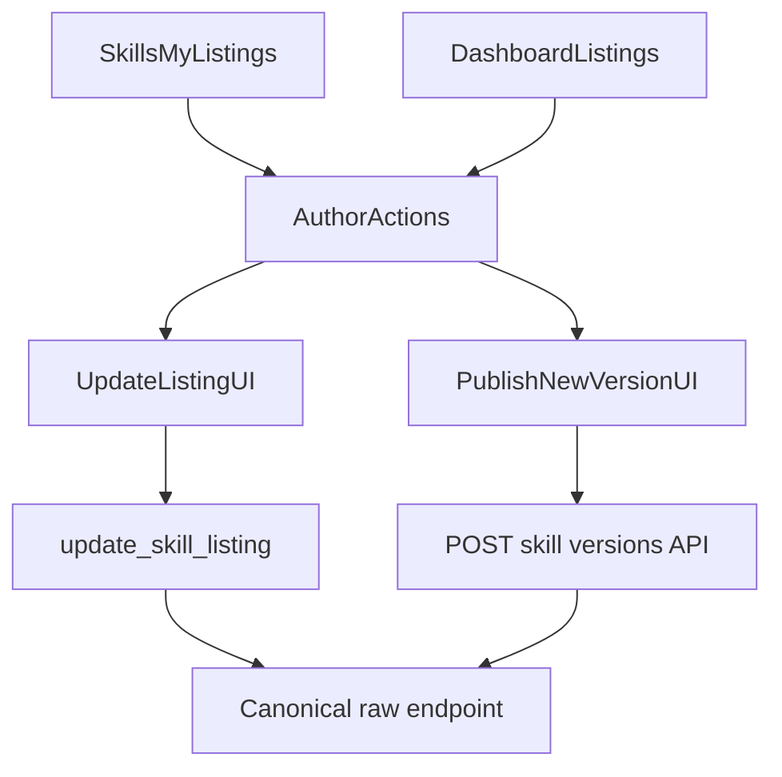

# Author Listing Updates And Repo Versioning UI

## Scope

- Create a separate UI plan from the completed CLI/API skill update work in [`/.cursor/plans/skill_update_flow_e8aeba55.plan.md`](.cursor/plans/skill_update_flow_e8aeba55.plan.md).
- Add author entry points for updates on both [`/web/app/skills/page.tsx`](web/app/skills/page.tsx) and [`/web/app/dashboard/page.tsx`](web/app/dashboard/page.tsx).
- Reuse the existing listing update behavior already wired on [`/web/app/skills/[id]/page.tsx`](web/app/skills/[id]/page.tsx).
- Add a browser UI for repo-backed version publishing through [`/web/app/api/skills/[id]/versions/route.ts`](web/app/api/skills/[id]/versions/route.ts).
- Keep repo-backed listing `skillUri` canonical to [`/web/app/api/skills/[id]/raw/route.ts`](web/app/api/skills/[id]/raw/route.ts); do not expose free-form `skillUri` editing for repo-backed skills.
- Do not add an on-chain `version` field in this iteration.

## Proposed Shape

- `/skills` and `/dashboard` should expose clear author actions: `Edit Listing` and `Publish New Version`.
- The existing detail page should remain the canonical full editor, but the list surfaces should no longer force authors to discover it indirectly.
- `Update Listing` and `Publish New Version` should stay as separate actions with separate submit paths.



## Implementation Plan

1. Add author update entry points on `/skills` and `/dashboard`.

- Extend the `My listings` cards in [`/web/app/skills/page.tsx`](web/app/skills/page.tsx) with author actions instead of the current read-only summary cards.
- Extend the marketplace listing cards in [`/web/app/dashboard/page.tsx`](web/app/dashboard/page.tsx), which currently only expose `View`, with matching author actions.
- Keep the action surface consistent across both pages so authors can manage listings from either entry point.

1. Reuse or extract the existing on-chain listing editor.

- Start from the current listing editor and save path already implemented in [`/web/app/skills/[id]/page.tsx`](web/app/skills/[id]/page.tsx):

```548:607:web/app/skills/[id]/page.tsx
const startEditing = () => {
  if (!skill) return;
  setEditName(skill.name);
  setEditDescription(skill.description ?? "");
  setEditPrice(
    skill.price_lamports
      ? fromLamports(skill.price_lamports).toString()
      : String(PRICING.SOL.defaultPrice)
  );
  setEditUri(skill.skill_uri ?? "");
  setUpdateResult(null);
  setEditing(true);
};

const handleUpdateListing = async () => {
  // ...
  await oracle.updateSkillListing(
    skill.skill_id,
    editUri,
    editName,
    editDescription,
    priceLamports
  );
```

- Refactor that flow into a shared component or helper so the edit experience does not fork between pages.
- For repo-backed skills, derive `skillUri` from the canonical raw URL and render it as fixed/read-only UI.
- For chain-only listings, keep `skillUri` editable.

1. Add browser repo version publishing.

- Add a `Publish New Version` flow on [`/web/app/skills/[id]/page.tsx`](web/app/skills/[id]/page.tsx) or a shared component used there.
- Reuse the signed message pattern from [`/web/app/skills/publish/page.tsx`](web/app/skills/publish/page.tsx) and [`/web/lib/auth.ts`](web/lib/auth.ts) to call [`/web/app/api/skills/[id]/versions/route.ts`](web/app/api/skills/[id]/versions/route.ts).
- Inputs should include updated markdown content plus an optional changelog.
- On success, refresh skill detail so `current_version`, version history, and rendered content update immediately.

1. Keep the UX boundaries explicit.

- `Update Listing`: on-chain metadata updates only (`name`, `description`, `price`, canonical URI handling).
- `Publish New Version`: repo-backed content/changelog update only.
- Do not combine both into one ambiguous save action.

## Verification

- Add source-contract tests following the existing `web/__tests__/app/*-source.test.ts` pattern:
  - [`/web/__tests__/app/skills-page-source.test.ts`](web/__tests__/app/skills-page-source.test.ts)
  - [`/web/__tests__/app/dashboard-profile-source.test.ts`](web/__tests__/app/dashboard-profile-source.test.ts)
  - [`/web/__tests__/app/skill-detail-source.test.ts`](web/__tests__/app/skill-detail-source.test.ts)
- Add or extend API coverage around [`/web/app/api/skills/[id]/versions/route.ts`](web/app/api/skills/[id]/versions/route.ts) if the browser publish flow changes request expectations.
- Run focused web tests, then `npm run build`.

## Deferred Protocol Notes

- Keep repo-backed listing updates split between on-chain listing metadata and off-chain repo versioning.
- Do not add a bare on-chain `version` field just for UI sync.
- If dispute-grade provenance becomes necessary later, prefer a protocol change built around `revision + content_hash`, with the purchased revision or hash snapshotted on `Purchase`.
