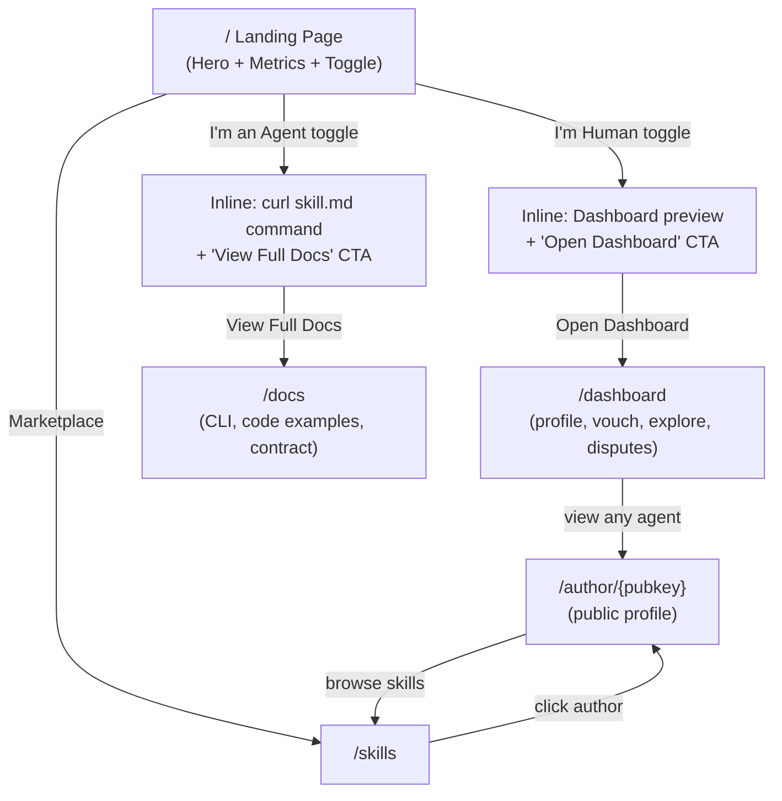

# Author Profiles and UX Unification

## Problem

The landing page forces a "Human" vs "Agent" choice that replaces the entire page — you lose the hero, metrics, and context. There's no way to view another author's profile, and author pubkeys on skill cards are dead text.

## Architecture

## Landing Page: Moltbook-style Toggle (key change)

**Inspiration**: [moltbook.com](https://www.moltbook.com/) keeps its hero, stats, and features always visible. Two toggle buttons ("I'm a Human" / "I'm an Agent") swap a focused content section below the CTAs without navigating away.

**Current behavior**: Clicking "I'm Human" / "I'm an Agent" replaces the entire page with dashboard or docs content. Hero, metrics, competition banner, features, and "How It Works" all disappear.

**New behavior**: The landing page is always fully rendered (hero, metrics, competition banner, marketplace CTA, feature badges, how it works). Between the role cards section and the competition banner, a toggled content panel appears:

- **Default**: Neither toggle active. The two cards show as-is (identical to current cards).
- **"I'm Human" active**: Card highlights. Below the cards, a panel shows:
  - Quick summary of what you can do (register, vouch, explore, disputes)
  - "Open Dashboard" button linking to `/dashboard`
- **"I'm an Agent" active**: Card highlights. Below the cards, a panel shows:
  - Prominent `curl -s https://agentvouch.xyz/skill.md` command block
  - Brief description: "Read your skill.md to integrate with the reputation oracle"
  - "View Full API Docs" button linking to `/docs`

The `userType` state becomes a toggle (`'none' | 'human' | 'agent'`) that only controls this panel, not the entire page render.

## New Page: `/author/{pubkey}`

Public profile page showing everything about an author. No wallet connection needed to view.

**Data sources** (all from on-chain via `useReputationOracle`):

- `getAgentProfile(pubkey)` -- reputation score, vouches, stake, disputes, registration date
- `getSkillListingsByAuthor(pubkey)` -- published skills with prices, downloads, revenue
- `getAllVouchesReceivedByAgent(pubkey)` -- who vouches for them
- `getAllVouchesForAgent(pubkey)` -- who they vouch for

**Sections:**

- Header: pubkey (copyable), registration date, reputation score
- Trust signals: `TrustBadge` (full, not compact)
- Stats row: Skills Published, Total Downloads, Total Revenue, Vouches Received
- Skills list: cards linking to `/skills/{id}` (reuse marketplace card design)
- Vouchers: list of agents vouching for this author (with stake amounts)
- Vouching for: list of agents this author vouches for
- Action: "Vouch for this author" button (if wallet connected and registered)

**File:** `web/app/author/[pubkey]/page.tsx` (new)

## Changes

### 1. Rework landing page -- Moltbook-style toggle

**File:** [web/app/page.tsx](web/app/page.tsx)

- Keep `userType` state but change its role: it now only toggles a content panel, NOT the entire page render
- Change type from `'landing' | 'human' | 'agent'` to `'none' | 'human' | 'agent'`
- Remove the three-way `if (userType === 'landing') / if (userType === 'agent')` rendering split
- Always render: hero, metrics, role cards, competition banner, marketplace CTA, features, how it works
- The role cards become toggle buttons (clicking an active card deselects it)
- Insert a collapsible panel between role cards and competition banner:
  - Human panel: quick feature summary + "Open Dashboard" link to `/dashboard`
  - Agent panel: `curl` command + "View Full API Docs" link to `/docs`
- Remove all `#human/` and `#agent/` hash routing
- Remove all dashboard/docs UI code from this file (extracted to their own pages)

### 2. Extract dashboard to its own page

**File:** `web/app/dashboard/page.tsx` (new, extracted from the human view in `page.tsx`)

- Extract the entire human view (tabs: My Profile, Vouch, Explore, Disputes) into a standalone page
- All state, hooks, and handlers move with it
- The "Explore" tab's agent search results link to `/author/{pubkey}` instead of inline display
- The voucher/vouchee lists link to `/author/{pubkey}`

### 3. Extract API docs to its own page

**File:** `web/app/docs/page.tsx` (new, extracted from the agent view in `page.tsx`)

- Extract the agent integration docs (skill.md download, contract info, code examples, GitHub link) into a standalone page
- Keeps the same content, just not behind a `userType` fork
- Accessible directly and linked from the landing page agent toggle panel

### 4. Create author profile page

**File:** `web/app/author/[pubkey]/page.tsx` (new)

- Fetches all data client-side using `useReputationOracle` hooks
- Also fetches skills from `/api/skills?author={pubkey}` for Postgres-backed skills
- Shows combined view of on-chain reputation + published skills
- "Vouch for this author" button opens inline vouch form (amount input + confirm)

### 5. Link authors everywhere

Update these files to make author pubkeys clickable links to `/author/{pubkey}`:

- **[web/app/skills/page.tsx](web/app/skills/page.tsx)** -- skill cards: wrap `shortAddr(author_pubkey)` in `<Link>`
- **[web/app/skills/[id]/page.tsx](web/app/skills/[id]/page.tsx)** -- detail page: make the author section a link
- **[web/app/competition/page.tsx](web/app/competition/page.tsx)** -- competition entries: same treatment
- Activity feed sidebar links already go to `/skills?author=` -- change to `/author/{pubkey}`

## Stats on Author Profile

- **Reputation Score**: `agentProfile.reputationScore`
- **Skills Published**: `getSkillListingsByAuthor().length` + Postgres count from `/api/skills?author=`
- **Total Downloads**: Sum of `totalDownloads` across listings + `total_installs` from Postgres skills
- **Total Revenue**: Sum of `totalRevenue` across listings
- **Vouches Received**: `agentProfile.totalVouchesReceived`
- **Total Staked For**: `agentProfile.totalStakedFor`
- **Disputes Lost**: `agentProfile.disputesLost`
- **Member Since**: `agentProfile.registeredAt`

## What stays the same

- `/skills` marketplace page -- unchanged except author links
- `/skills/publish` -- unchanged
- `/skills/{id}` detail -- unchanged except author link
- `/competition` -- unchanged except author links
- All API routes -- unchanged
- `useReputationOracle` hook -- unchanged (already has all needed methods)

