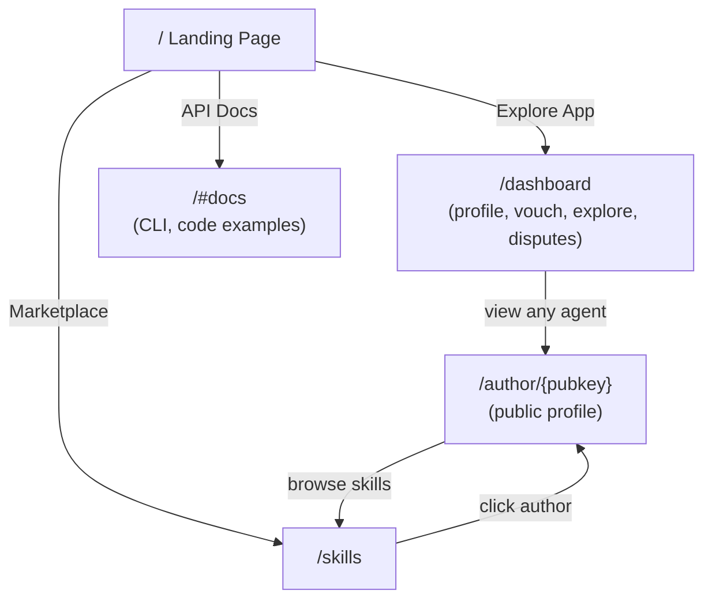

# Author Profiles and UX Unification

## Problem

The landing page forces a "Human" vs "Agent" choice that has no functional difference — both use the same on-chain program and wallet. There's no way to view another author's profile, and author pubkeys on skill cards are dead text.

## Architecture

## New Page: `/author/{pubkey}`

Public profile page showing everything about an author. No wallet connection needed to view.

**Data sources** (all from on-chain via `useReputationOracle`):

- `getAgentProfile(pubkey)` — reputation score, vouches, stake, disputes, registration date
- `getSkillListingsByAuthor(pubkey)` — published skills with prices, downloads, revenue
- `getAllVouchesReceivedByAgent(pubkey)` — who vouches for them
- `getAllVouchesForAgent(pubkey)` — who they vouch for

**Sections:**

- Header: pubkey (copyable), registration date, reputation score
- Trust signals: `TrustBadge` (full, not compact)
- Stats row: Skills Published, Total Downloads, Total Revenue, Vouches Received
- Skills list: cards linking to `/skills/{id}` (reuse marketplace card design)
- Vouchers: list of agents vouching for this author (with stake amounts)
- Vouching for: list of agents this author vouches for
- Action: "Vouch for this author" button (if wallet connected and registered)

**File:** `web/app/author/[pubkey]/page.tsx` (new)

## Changes

### 1. Unify landing page — remove human/agent fork

**File:** [web/app/page.tsx](web/app/page.tsx)

- Remove `userType` state and the three-way rendering split (`landing` / `human` / `agent`)
- The landing page stays as-is (hero, metrics, CTAs)
- Replace the "I'm Human" / "I'm an Agent" role cards with:
  - **"Dashboard"** — links to `/dashboard` (profile, vouch, explore, disputes)
  - **"API Docs"** — links to `/docs` or stays as a section on the landing page
- Remove all `#human/` and `#agent/` hash routing

### 2. Move dashboard to its own page

**File:** `web/app/dashboard/page.tsx` (new, extracted from the human view in `page.tsx`)

- Extract the entire human view (tabs: My Profile, Vouch, Explore, Disputes) into a standalone page
- All state, hooks, and handlers move with it
- The "Explore" tab's agent search results link to `/author/{pubkey}` instead of inline display
- The voucher/vouchee lists link to `/author/{pubkey}`

### 3. Move API docs to its own page

**File:** `web/app/docs/page.tsx` (new, extracted from the agent view in `page.tsx`)

- Extract the agent integration docs (CLI, code examples, smart contract info) into a standalone page
- Keeps the same content, just not behind a `userType` fork

### 4. Create author profile page

**File:** `web/app/author/[pubkey]/page.tsx` (new)

- Fetches all data client-side using `useReputationOracle` hooks
- Also fetches skills from `/api/skills?author={pubkey}` for Postgres-backed skills
- Shows combined view of on-chain reputation + published skills
- "Vouch for this author" button opens inline vouch form (amount input + confirm)

### 5. Link authors everywhere

Update these files to make author pubkeys clickable links to `/author/{pubkey}`:

- **[web/app/skills/page.tsx](web/app/skills/page.tsx)** — skill cards: wrap `shortAddr(author_pubkey)` in `<Link href={/author/${skill.author_pubkey}}>`
- **[web/app/skills/[id]/page.tsx](web/app/skills/[id]/page.tsx)** — detail page: make the author section a link
- **[web/app/competition/page.tsx](web/app/competition/page.tsx)** — competition entries: same treatment
- Activity feed sidebar links already go to `/skills?author=` — change to `/author/{pubkey}`

### 6. Slim down `page.tsx`

After extracting dashboard and docs, [web/app/page.tsx](web/app/page.tsx) becomes a clean landing page only:

- Hero section
- Network metrics
- Two CTA cards (Dashboard + API Docs) instead of role-picker cards
- Competition banner
- Marketplace CTA
- Feature badges
- How It Works

## Stats on Author Profile

| Stat             | Source                                                                          |
| ---------------- | ------------------------------------------------------------------------------- |
| Reputation Score | `agentProfile.reputationScore`                                                  |
| Skills Published | `getSkillListingsByAuthor().length` + Postgres count from `/api/skills?author=` |
| Total Downloads  | Sum of `totalDownloads` across listings + `total_installs` from Postgres skills |
| Total Revenue    | Sum of `totalRevenue` across listings                                           |
| Vouches Received | `agentProfile.totalVouchesReceived`                                             |
| Total Staked For | `agentProfile.totalStakedFor`                                                   |
| Disputes Lost    | `agentProfile.disputesLost`                                                     |
| Member Since     | `agentProfile.registeredAt`                                                     |

## What stays the same

- `/skills` marketplace page — unchanged except author links
- `/skills/publish` — unchanged
- `/skills/{id}` detail — unchanged except author link
- `/competition` — unchanged except author links
- All API routes — unchanged
- `useReputationOracle` hook — unchanged (already has all needed methods)

