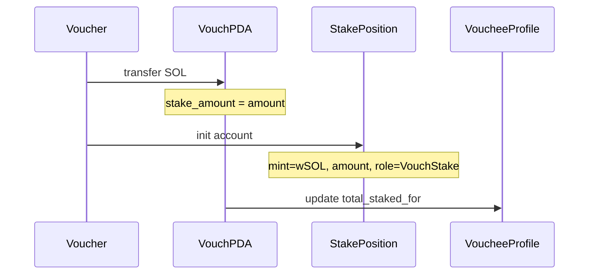

# Phase 1: State Model Refactor for Multi-Asset Staking

## Objective

Refactor account schemas to support multi-asset stake positions while preserving SOL-only runtime behavior. After this phase, the data model is ready for USDC (Phase 2), but the program still only accepts native SOL. Clean break on devnet — fresh redeploy, no v1 account compatibility.

## What changes and what doesn't

**Changes:**

- `Vouch.stake_amount: u64` becomes a reference to a separate `StakePosition` account
- New `StakePosition` account: `{ vouch, mint, amount, role, lock_state, created_at }`
- New `MintAllowlist` config account with governance controls
- `ReputationConfig` gets a `supported_mints` reference
- All events get `mint` and `chain_context` fields
- `AgentProfile.total_staked_for` stays as-is (aggregate across all mints — updated per-stake)

**Stays the same:**

- All instruction signatures (vouch still takes `stake_amount: u64`)
- PDA seeds for existing accounts
- SOL-only transfers (no SPL token logic yet)
- All user-facing behavior

## Account Schema Changes

### New: StakePosition

One account per (vouch, mint) pair. In Phase 1, every vouch creates exactly one StakePosition with `mint = wSOL`.

```rust
#[account]
pub struct StakePosition {
    pub vouch: Pubkey,           // Parent vouch
    pub mint: Pubkey,            // Token mint (wSOL for Phase 1)
    pub amount: u64,             // Raw token units
    pub role: StakeRole,         // VouchStake, DisputeBond, FeeReserve
    pub lock_state: LockState,   // Unlocked or Locked(dispute pubkey)
    pub created_at: i64,
    pub bump: u8,
}

#[derive(AnchorSerialize, AnchorDeserialize, Clone, Copy, PartialEq, Eq)]
pub enum StakeRole {
    VouchStake,
    DisputeBond,
    FeeReserve,
}

#[derive(AnchorSerialize, AnchorDeserialize, Clone, Copy, PartialEq, Eq)]
pub enum LockState {
    Unlocked,
    Locked,  // locked during active dispute
}
```

PDA seeds: `[b"stake_position", vouch.key(), mint.key()]`

### New: MintAllowlist

Governance-controlled list of accepted mints. Phase 1 initializes with wSOL only.

```rust
#[account]
pub struct MintAllowlist {
    pub authority: Pubkey,
    pub mints: Vec<Pubkey>,      // max 8 mints
    pub bump: u8,
}
```

PDA seeds: `[b"mint_allowlist"]`

### Modified: Vouch

Keep `stake_amount` on Vouch for backward-compatible reads (aggregate across positions), but the source of truth moves to StakePosition accounts.

```rust
pub struct Vouch {
    pub voucher: Pubkey,
    pub vouchee: Pubkey,
    pub stake_amount: u64,       // aggregate across all positions (kept for convenience)
    pub created_at: i64,
    pub status: VouchStatus,
    pub cumulative_revenue: u64,
    pub last_payout_at: i64,
    pub bump: u8,
}
```

No size change — `stake_amount` remains but is now an aggregate cache.

### Modified: ReputationConfig

Add `mint_allowlist` reference:

```rust
pub struct ReputationConfig {
    // ... existing fields ...
    pub mint_allowlist: Pubkey,  // +32 bytes
    pub bump: u8,
}
```

### Unchanged

- `AgentProfile` — `total_staked_for` stays as aggregate u64
- `Dispute` — no changes
- `SkillListing` — no changes
- `Purchase` — no changes

## Instruction Changes

### `vouch` instruction

Currently: transfers SOL to vouch PDA, sets `vouch.stake_amount`.

After: also creates a `StakePosition` account alongside the vouch. The SOL still goes to the vouch PDA (Phase 2 switches to vault PDAs for SPL tokens). Sets `vouch.stake_amount` as before.

New accounts needed in `CreateVouch`:

- `stake_position` (init)
- `mint_allowlist` (read, to validate wSOL is allowed)

### `revoke_vouch` instruction

Currently: returns lamports from vouch PDA to voucher.

After: also closes the `StakePosition` account. Returns rent from position account to voucher.

New accounts needed in `RevokeVouch`:

- `stake_position` (mut, close)

### `open_dispute` instruction

Currently: transfers bond to dispute PDA, marks vouch as Disputed.

After: also updates the StakePosition `lock_state` to `Locked`.

New accounts needed in `OpenDispute`:

- `stake_position` (mut)

### `resolve_dispute` instruction

Currently: slashing logic reads `vouch.stake_amount`.

After: reads from StakePosition, updates `lock_state` back to `Unlocked` (or account is effectively dead if slashed).

New accounts needed in `ResolveDispute`:

- `stake_position` (mut)

### `claim_voucher_revenue` instruction

No changes — revenue claiming reads `vouch.stake_amount` (the aggregate) and `author_profile.total_staked_for`. Both are still maintained.

### New: `initialize_mint_allowlist` instruction

Admin-only instruction to create the MintAllowlist account with initial wSOL mint.

### New: `update_mint_allowlist` instruction

Admin-only instruction to add/remove mints from the allowlist. Not exercised in Phase 1 beyond initialization, but the plumbing is ready for Phase 2.

## Event Schema Updates

Add `mint` and `chain_context` to all events. File: [programs/reputation-oracle/src/events.rs](programs/reputation-oracle/src/events.rs)

```rust
// Added to every event struct:
pub mint: String,           // "native" for Phase 1, SPL mint address for Phase 2+
pub chain_context: String,  // "solana" always for now
```

## Data Flow (Phase 1)




## Files Changed

### New files

- `programs/reputation-oracle/src/state/stake_position.rs` — StakePosition struct, StakeRole, LockState enums
- `programs/reputation-oracle/src/state/mint_allowlist.rs` — MintAllowlist struct
- `programs/reputation-oracle/src/instructions/initialize_mint_allowlist.rs` — init instruction
- `programs/reputation-oracle/src/instructions/update_mint_allowlist.rs` — add/remove mints

### Modified files

- [programs/reputation-oracle/src/state/mod.rs](programs/reputation-oracle/src/state/mod.rs) — add new module exports
- [programs/reputation-oracle/src/state/config.rs](programs/reputation-oracle/src/state/config.rs) — add `mint_allowlist: Pubkey` field, update LEN
- [programs/reputation-oracle/src/instructions/mod.rs](programs/reputation-oracle/src/instructions/mod.rs) — add new module exports
- [programs/reputation-oracle/src/instructions/vouch.rs](programs/reputation-oracle/src/instructions/vouch.rs) — create StakePosition alongside vouch, validate mint against allowlist
- [programs/reputation-oracle/src/instructions/revoke_vouch.rs](programs/reputation-oracle/src/instructions/revoke_vouch.rs) — close StakePosition, return rent
- [programs/reputation-oracle/src/instructions/open_dispute.rs](programs/reputation-oracle/src/instructions/open_dispute.rs) — lock StakePosition
- [programs/reputation-oracle/src/instructions/resolve_dispute.rs](programs/reputation-oracle/src/instructions/resolve_dispute.rs) — unlock/handle StakePosition on resolution
- [programs/reputation-oracle/src/instructions/initialize_config.rs](programs/reputation-oracle/src/instructions/initialize_config.rs) — accept and store `mint_allowlist` pubkey
- [programs/reputation-oracle/src/events.rs](programs/reputation-oracle/src/events.rs) — add `mint` and `chain_context` to all 7 events
- [programs/reputation-oracle/src/lib.rs](programs/reputation-oracle/src/lib.rs) — add `initialize_mint_allowlist` and `update_mint_allowlist` entry points

### Test changes

- [tests/reputation-oracle.ts](tests/reputation-oracle.ts) — update `initialize_config` call to include mint_allowlist, pass StakePosition + allowlist accounts to vouch/revoke/dispute instructions
- [tests/marketplace.test.ts](tests/marketplace.test.ts) — same account additions for vouch calls, add StakePosition to claim flow
- New test: `tests/mint-allowlist.test.ts` — init allowlist, add/remove mints, verify vouch rejects unsupported mints

## Exit Criteria

- All 12 existing tests pass (8 reputation + 4 marketplace) after accounting for new required accounts
- New mint allowlist tests pass
- StakePosition accounts are created and closed correctly during vouch/revoke lifecycle
- StakePosition lock_state transitions correctly during dispute lifecycle
- All events include `mint` and `chain_context` fields
- `anchor test` passes clean on localnet
- `anchor deploy` succeeds on devnet (clean break)

## Mainnet note

This is a devnet clean break. When deploying to mainnet, the program must include a version discriminator byte on all accounts and support versioned deserialization for zero-downtime upgrades. That infrastructure is deferred to the mainnet readiness phase per the decision documented in [docs/multi-asset-staking-and-x402-plan.md](docs/multi-asset-staking-and-x402-plan.md) section 9.1.