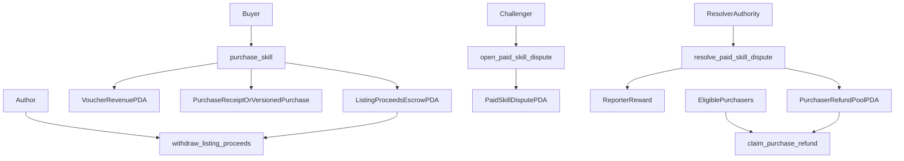

# Skill Refund Escrow Plan

## Goal

Replace direct author wallet payouts for paid skill purchases with program-controlled settlement so buyer success no longer depends on seller wallet rent state, then add skill/version-scoped purchaser restitution when a paid skill dispute is upheld.

## Current Constraints

- [programs/reputation-oracle/src/instructions/purchase_skill.rs](programs/reputation-oracle/src/instructions/purchase_skill.rs) sends `60%` directly to `author` and `40%` to the `SkillListing` PDA.
- [programs/reputation-oracle/src/instructions/resolve_author_dispute.rs](programs/reputation-oracle/src/instructions/resolve_author_dispute.rs) currently pays the challenger `bond + total_slashed_amount` on uphold.
- [programs/reputation-oracle/src/state/purchase.rs](programs/reputation-oracle/src/state/purchase.rs) only records `buyer`, `skill_listing`, `purchased_at`, and `price_paid`; it does not explicitly pin a purchased version/content hash.
- [web/lib/x402.ts](web/lib/x402.ts) and [web/app/api/skills/[id]/raw/route.ts](web/app/api/skills/[id]/raw/route.ts) treat `Purchase` existence as the entitlement proof.

## Target Settlement Model

## Payout Waterfall

- On upheld paid-skill dispute, refund `100%` of the challenger bond first.
- Pay the challenger a fixed reporter reward of `20%` of the slashed amount.
- Route the remaining `80%` of the slashed amount into a purchaser refund pool.
- Let eligible purchasers claim pro rata, capped at `price_paid`.
- Sweep unclaimed funds after a fixed claim window into a protocol reserve, never back to the author.

## Scope Decisions

- Compensation is scoped to the disputed paid `skill/version`, not author-wide across unrelated skills.
- Author-wide reputation disputes can remain author-wide for slashing and reputation effects, but purchaser restitution must be tied to a specific sale cohort.
- Refunds should be claim-based, not pushed inline during dispute resolution.
- Keep the current purchase-price-transparency work in place until the escrow model is live.

## Phase 1: On-Chain Data Model

- Add a proceeds escrow account for the author leg of a listing, separate from the existing voucher revenue balance.
- Add version-aware purchase metadata. Preferred direction: extend `Purchase` with immutable skill content/version identity captured at purchase time.
- Add dispute/refund state needed for paid-skill restitution: dispute-to-skill linkage, refund pool balance, claim window, claimed totals, and per-purchase claim tracking.
- Update [docs/ARCHITECTURE.md](docs/ARCHITECTURE.md) terminology and account tables once the model is stable.

## Phase 2: Purchase and Withdraw Flow

- Refactor [programs/reputation-oracle/src/instructions/purchase_skill.rs](programs/reputation-oracle/src/instructions/purchase_skill.rs) so buyer funds go to program-controlled escrow PDAs instead of directly to `author`.
- Add an explicit author withdrawal instruction to move author proceeds from escrow to an author-chosen destination wallet.
- Preserve the voucher-pool claim flow, but make the accounting explicit so author proceeds and voucher revenue cannot mix.
- Regenerate IDL and web client types after program changes.

## Phase 3: Paid Skill Dispute and Refund Flow

- Extend or complement the current author dispute flow with a paid-skill dispute path that references a specific listing/version and purchase cohort.
- Update settlement so upheld paid-skill disputes split slash proceeds into reporter reward and purchaser refund pool instead of sending all slashed funds to the challenger.
- Add purchaser claim instruction(s) with pro-rata capped payout math and per-purchase replay protection.
- Define reserve sweep behavior after claim expiry.

## Phase 4: Web and x402 Integration

- Update [web/lib/x402.ts](web/lib/x402.ts) and the `raw`/`install` routes so entitlement still keys off successful purchase, but UI/API can also surface escrow/refund/dispute status.
- Refactor [web/hooks/useReputationOracle.ts](web/hooks/useReputationOracle.ts) to support author withdraw, paid-skill dispute actions, and purchaser refund claims.
- Update [web/app/skills/page.tsx](web/app/skills/page.tsx), [web/app/skills/[id]/page.tsx](web/app/skills/[id]/page.tsx), and [web/app/dashboard/page.tsx](web/app/dashboard/page.tsx) to show:
  - proceeds held in escrow
  - refund eligibility / claimed status
  - author withdraw status
  - dispute state for paid skills
- Update agent-facing docs in [web/public/skill.md](web/public/skill.md) if payment proof semantics or agent flows change.

## Migration Strategy

- Keep current `Purchase`-based entitlement working during rollout.
- Introduce new escrow/refund accounts in a backward-compatible program upgrade rather than rewriting old receipts.
- Treat old direct-settlement purchases as non-refundable legacy purchases unless you explicitly add an off-chain migration/indexing layer.
- Roll out web support after the upgraded program and regenerated client are stable.

## Verification

- Anchor tests for:
  - escrowed purchase settlement
  - author withdrawal
  - upheld paid-skill dispute payout waterfall
  - capped pro-rata purchaser claims
  - claim replay prevention and claim-window expiry
- Web tests for purchase state, withdraw state, refund eligibility, and x402 verification compatibility.
- `npm test` and `npm run build` in [web/](web/), plus full Anchor test suite.

## Main Risks

- Version-scoping is underspecified in the current `Purchase` account, so get the version/content identity right before implementing refunds.
- Inline settlement across many purchasers is not scalable; keep purchaser payouts claim-based.
- Mixing author proceeds with voucher revenue in one PDA will make accounting and audits harder; keep those ledgers distinct.

