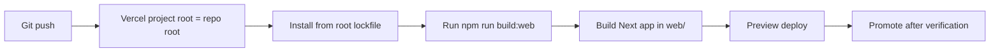

# Vercel Phase 2 Migration

## Target Shape
- Keep the Next app in [web](file:///Users/andysustic/Repos/agent-reputation-oracle/web), but move the Vercel project root from `web` to the repo root.
- Make the root lockfile and root workspace install path canonical on Vercel, matching [package.json](file:///Users/andysustic/Repos/agent-reputation-oracle/package.json).
- Build only the web app on Vercel, using the existing `build:web` root script in [package.json](file:///Users/andysustic/Repos/agent-reputation-oracle/package.json), not the root `build` script that runs every workspace.
- Consolidate deploy overrides into a repo-root [vercel.json](file:///Users/andysustic/Repos/agent-reputation-oracle/vercel.json) and retire [web/vercel.json](file:///Users/andysustic/Repos/agent-reputation-oracle/web/vercel.json) as the source of truth.

## Repo Changes
- Add a root [vercel.json](file:///Users/andysustic/Repos/agent-reputation-oracle/vercel.json) with explicit root-scoped install/build commands.
- Default install command to `npm ci` from the repo root. If preview validation shows npm peer-resolution drift on Vercel, keep `npm install --legacy-peer-deps` as a temporary root install command and treat removal of that flag as a separate cleanup task.
- Keep using the root `build:web` entrypoint already defined in [package.json](file:///Users/andysustic/Repos/agent-reputation-oracle/package.json): `npm run build --workspace @agentvouch/web`.
- Remove deploy-only assumptions from [web/vercel.json](file:///Users/andysustic/Repos/agent-reputation-oracle/web/vercel.json); either delete it or reduce it to app-local settings that still matter after the root cutover.
- Reconcile docs and memory with the actual config state:
  - [AGENTS.md](file:///Users/andysustic/Repos/agent-reputation-oracle/AGENTS.md)
  - [README.md](file:///Users/andysustic/Repos/agent-reputation-oracle/README.md)
  - [docs/DEPLOY.md](file:///Users/andysustic/Repos/agent-reputation-oracle/docs/DEPLOY.md)
  - [web/next.config.mjs](file:///Users/andysustic/Repos/agent-reputation-oracle/web/next.config.mjs)
- Specifically remove stale phase-1 guidance that still says Vercel deploys from `web` or that `turbopack.root` is configured in [web/next.config.mjs](file:///Users/andysustic/Repos/agent-reputation-oracle/web/next.config.mjs), because that is no longer true on disk.

## Vercel Cutover
- In the Vercel dashboard for the `agentvouch` project, change Root Directory from `web` to the repo root.
- Ensure Vercel uses the root config and the root lockfile during install.
- Keep the framework target as the Next app under `web/`; if Vercel’s framework detection is ambiguous after the root switch, explicitly set the framework/build settings in the project dashboard rather than relying on auto-detection.
- Do the cutover on a preview branch first, not directly on production.

## Verification Gates
- Local:
  - `npm ci` from repo root
  - `npm run build:web`
  - `npm run build`
- Vercel preview:
  - install runs from repo root using the committed root lockfile
  - build runs only for `@agentvouch/web`
  - no `Can't resolve` workspace-package regressions
  - no `outputFileTracingRoot` / `turbopack.root` drift warnings
- Runtime smoke checks on the preview deployment:
  - `/`
  - `/skills`
  - `/author/[pubkey]`
  - `GET /api/skills/[id]/raw`
  - wallet-connected flow that depends on `NEXT_PUBLIC_*` env vars
- Only promote to production after the preview deployment matches current behavior.

## Rollback
- Keep the current `web`-rooted Vercel settings documented until phase 2 is proven in preview.
- If the repo-root preview fails late in the cutover, revert the Vercel project Root Directory back to `web`, restore the previous install/build settings, and redeploy or promote the last known-good deployment.
- Treat rollback readiness as part of the migration itself, not an afterthought.

## Risks To Watch
- The main failure mode is accidentally pointing Vercel at the repo root and then running the root `build` script, which would build all workspaces and may fail or waste time.
- The second failure mode is Vercel auto-detecting the wrong app boundary after the root switch; plan for one explicit dashboard review during the preview cutover.
- Root installs may surface peer-dependency issues currently masked by [web/vercel.json](file:///Users/andysustic/Repos/agent-reputation-oracle/web/vercel.json), so keep the install-command choice as an explicit verification checkpoint.