# Agent Reputation Oracle - Architecture Analysis

**Analysis Date:** February 16, 2026  
**Program ID:** `ELmVnLSNuwNca4PfPqeqNowoUF8aDdtfto3rF9d89wf`  
**Network:** Solana Devnet

---

## Executive Summary

Agent Reputation Oracle is a decentralized trust layer for AI agents on Solana, implementing an on-chain reputation system with economic incentives. The system uses stake-based vouching, dispute resolution with slashing, and a skill marketplace with revenue sharing.

**Key Metrics:**
- 8 on-chain instructions
- 6 account types (state structures)
- 2 major subsystems (reputation + marketplace)
- Full test coverage with integration tests
- Next.js web UI with Solana wallet integration

---

## System Architecture

### High-Level Overview

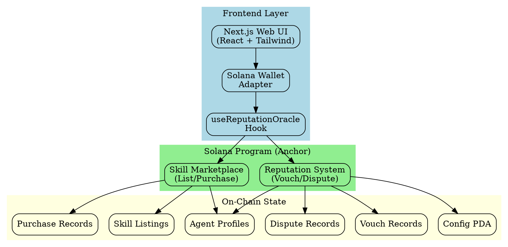

---

## Core Components

### 1. State Architecture

```dot
digraph StateModel {
    rankdir=LR;
    node [shape=record, style=rounded];
    
    Config [label="{ReputationConfig|+ authority: Pubkey\l+ min_stake: u64\l+ dispute_bond: u64\l+ slash_percentage: u8\l+ cooldown_period: i64\l+ stake_weight: u32\l+ vouch_weight: u32\l+ dispute_penalty: u32\l+ longevity_bonus: u32\l}"];
    
    Agent [label="{AgentProfile|+ authority: Pubkey\l+ metadata_uri: String\l+ reputation_score: u64\l+ total_vouches_received: u32\l+ total_vouches_given: u32\l+ total_staked_for: u64\l+ disputes_won: u32\l+ disputes_lost: u32\l+ registered_at: i64\l|compute_reputation()\l}"];
    
    Vouch [label="{Vouch|+ voucher: Pubkey\l+ vouchee: Pubkey\l+ stake_amount: u64\l+ created_at: i64\l+ status: VouchStatus\l+ cumulative_revenue: u64\l+ last_payout_at: i64\l}"];
    
    Dispute [label="{Dispute|+ vouch: Pubkey\l+ challenger: Pubkey\l+ evidence_uri: String\l+ status: DisputeStatus\l+ ruling: Option\<DisputeRuling\>\l+ created_at: i64\l+ resolved_at: Option\<i64\>\l}"];
    
    Skill [label="{SkillListing|+ author: Pubkey\l+ skill_uri: String\l+ name: String\l+ description: String\l+ price_lamports: u64\l+ total_downloads: u64\l+ total_revenue: u64\l+ created_at: i64\l+ status: SkillStatus\l}"];
    
    Purchase [label="{Purchase|+ buyer: Pubkey\l+ skill_listing: Pubkey\l+ purchased_at: i64\l+ price_paid: u64\l}"];
    
    Agent -> Vouch [label="gives/receives"];
    Vouch -> Dispute [label="can be disputed"];
    Agent -> Skill [label="authors"];
    Skill -> Purchase [label="generates"];
    Config -> Agent [label="configures"];
}
```

### 2. Instruction Flow

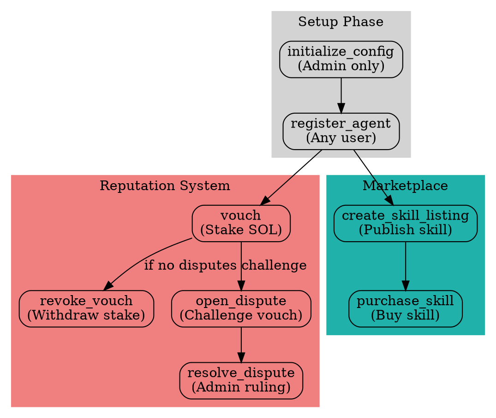

---

## Reputation System Deep Dive

### Reputation Score Calculation

The reputation score is computed dynamically using a weighted formula:

```
reputation_score = 
    (total_staked_for × stake_weight) +
    (total_vouches_received × vouch_weight) +
    (days_since_registration × longevity_bonus) -
    (disputes_lost × dispute_penalty)
```

**Default Weights (from config):**
- `stake_weight`: 1 point per lamport
- `vouch_weight`: 100 points per vouch
- `longevity_bonus`: 10 points per day
- `dispute_penalty`: 500 points per lost dispute

### Vouch Lifecycle

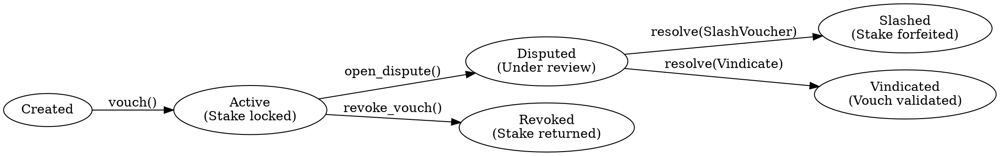

### Dispute Resolution Flow

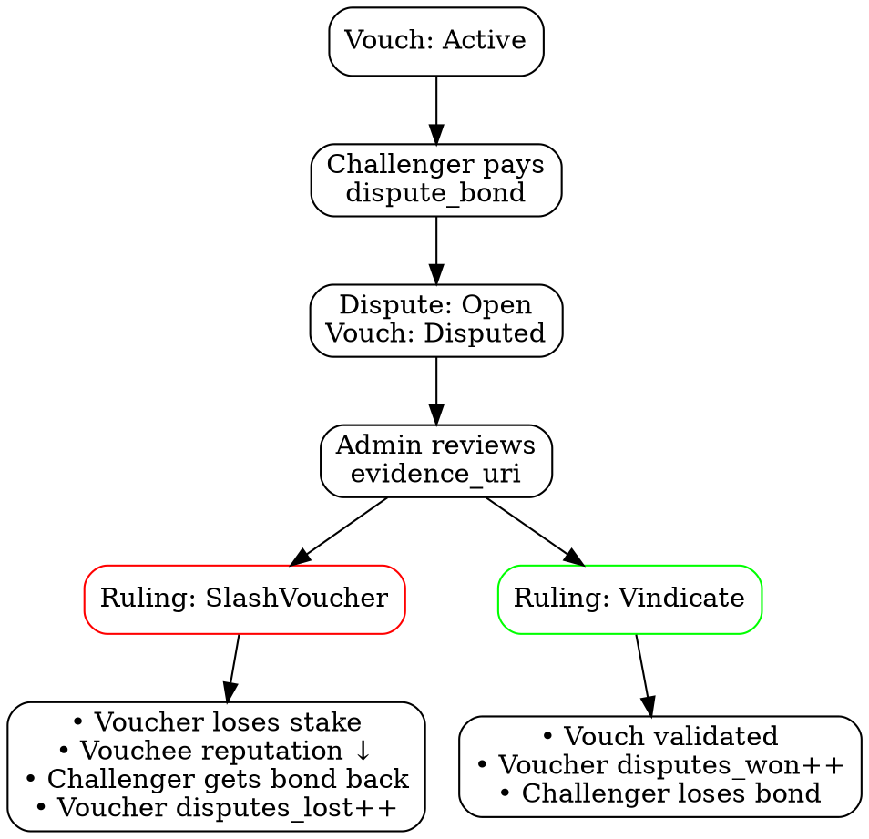

---

## Marketplace System

### Revenue Sharing Model

When a skill is purchased:

```
Purchase Price (100%)
├── Author (60%)
└── Voucher Pool (40%)
    └── Distributed proportionally to all vouchers
        based on stake_amount
```

**Implementation Notes:**
- Author payment is immediate (60% transferred on purchase)
- Voucher distribution is lazy (40% tracked in `cumulative_revenue`)
- Vouchers claim their share later (not yet implemented in v1)

### Skill Purchase Flow

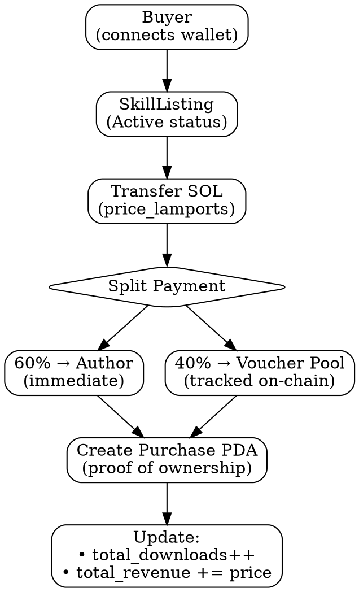

---

## PDA (Program Derived Address) Structure

All accounts use deterministic PDAs for security and predictability:

```
Config PDA:
  seeds = ["config"]

Agent PDA:
  seeds = ["agent", agent_authority]

Vouch PDA:
  seeds = ["vouch", voucher_profile, vouchee_profile]

Dispute PDA:
  seeds = ["dispute", vouch_account]

SkillListing PDA:
  seeds = ["skill", author_key, skill_id]

Purchase PDA:
  seeds = ["purchase", buyer_key, skill_listing]
```

---

## Frontend Architecture

### Component Hierarchy

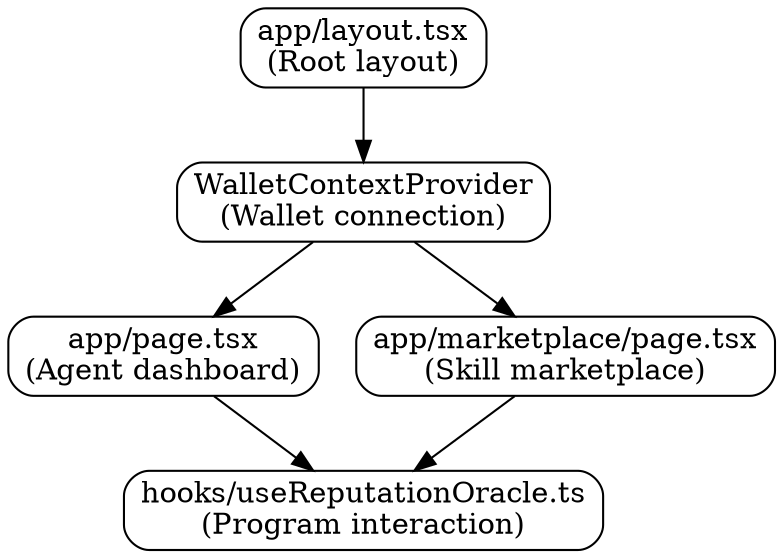

### Key Frontend Features

**useReputationOracle Hook provides:**
- PDA derivation functions (getAgentPDA, getVouchPDA, etc.)
- Instruction wrappers (registerAgent, vouch, purchaseSkill, etc.)
- Account fetching (getAgentProfile, getAllSkillListings, etc.)
- Wallet integration via Solana Wallet Adapter

---

## Security Model

### Economic Security

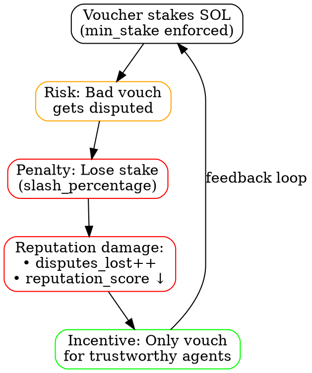

### Access Control

| Instruction | Authorization | Constraints |
|------------|---------------|-------------|
| `initialize_config` | Admin only | One-time setup |
| `register_agent` | Any user | Self-registration |
| `vouch` | Any registered agent | Cannot vouch for self, min_stake required |
| `revoke_vouch` | Voucher only | No active disputes |
| `open_dispute` | Any user | Requires dispute_bond |
| `resolve_dispute` | Admin only | Dispute must be open |
| `create_skill_listing` | Agent author | Must be registered |
| `purchase_skill` | Any user | Skill must be active |

---

## Data Flow Diagrams

### Vouching Process

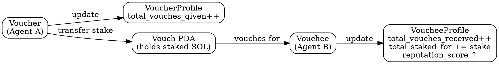

### Skill Purchase Data Flow

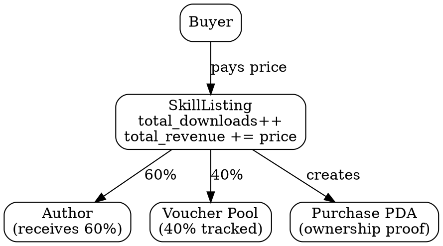

---

## Testing Architecture

### Test Coverage

**Test File:** `tests/reputation-oracle.ts`

**Test Scenarios:**
1. ✅ Config initialization
2. ✅ Agent registration (multiple agents)
3. ✅ Vouch creation with stake transfer
4. ✅ Reputation score computation
5. ✅ Vouch revocation with stake return
6. ✅ Dispute opening with bond
7. ✅ Dispute resolution (slash ruling)
8. ✅ Profile updates after disputes

**Test Flow:**

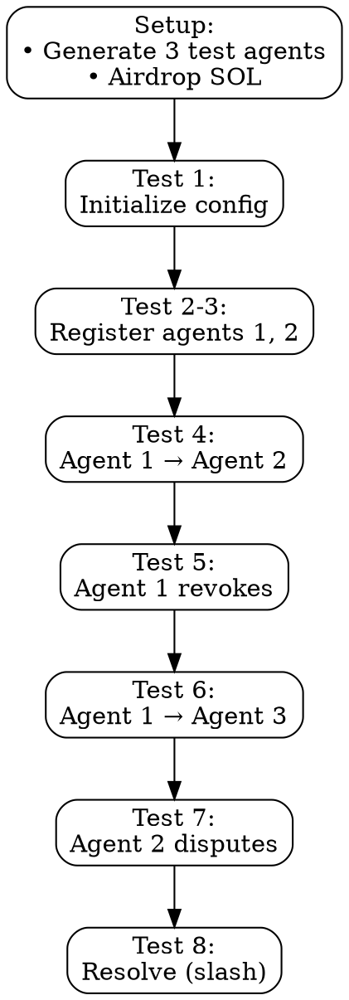

---

## Technology Stack

### Smart Contract Layer

```
Solana Program (Rust)
├── Framework: Anchor 0.32.1
├── Language: Rust (edition 2021)
├── Deployment: Solana Devnet
└── Program ID: ELmVnLSNuwNca4PfPqeqNowoUF8aDdtfto3rF9d89wf
```

### Frontend Layer

```
Next.js Application
├── Framework: Next.js 16.1.6
├── UI: React 19.2.3 + Tailwind CSS 4
├── Wallet: Solana Wallet Adapter 0.15.39
├── Blockchain: @solana/web3.js 1.98.4
└── Program Interaction: @coral-xyz/anchor 0.32.1
```

### Development Tools

```
Development Environment
├── Package Manager: Yarn
├── Testing: Anchor Test (ts-mocha)
├── Linting: ESLint + Prettier
└── TypeScript: 5.7.3
```

---

## Key Design Patterns

### 1. Isnad Chain Pattern

Inspired by Islamic hadith authentication, the system creates verifiable chains of trust:

```
Agent A (voucher) → Agent B (vouchee) → Agent C (vouchee)
  ↓ stake: 0.1 SOL    ↓ stake: 0.05 SOL
  
Trust propagates through the chain, weighted by stake amounts.
```

### 2. Lazy Revenue Distribution

Voucher revenue is tracked but not immediately distributed:

```rust
// In Vouch account:
pub cumulative_revenue: u64,  // Total earned
pub last_payout_at: i64,      // Last claim time

// Future claim instruction (not yet implemented):
// claim_voucher_revenue() → calculates proportional share
```

### 3. PDA-Based Account Security

All accounts use Program Derived Addresses:
- Deterministic (no need to store addresses)
- Secure (only program can sign)
- Efficient (predictable lookups)

### 4. Reputation Score Composability

Reputation is computed on-the-fly, not stored:

```rust
impl AgentProfile {
    pub fn compute_reputation(&self, config: &ReputationConfig) -> u64 {
        // Dynamic calculation based on current state
        stake_component + vouch_component + longevity - penalties
    }
}
```

---

## Deployment Architecture

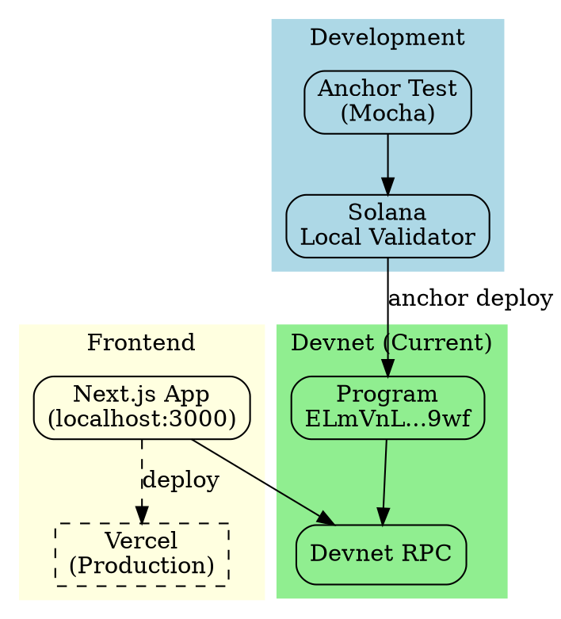

---

## Performance Characteristics

### Transaction Costs (Estimated)

| Operation | Compute Units | Rent (SOL) | Notes |
|-----------|---------------|------------|-------|
| initialize_config | ~5,000 | 0.002 | One-time |
| register_agent | ~8,000 | 0.003 | Per agent |
| vouch | ~12,000 | 0.002 + stake | Transfers stake |
| revoke_vouch | ~10,000 | 0 (refund) | Returns stake |
| open_dispute | ~9,000 | 0.002 + bond | Requires bond |
| resolve_dispute | ~15,000 | 0 | Admin only |
| create_skill_listing | ~10,000 | 0.004 | Per skill |
| purchase_skill | ~13,000 | 0.002 | Transfers payment |

### Account Sizes

| Account Type | Size (bytes) | Rent (SOL) |
|-------------|--------------|------------|
| ReputationConfig | 82 | ~0.0006 |
| AgentProfile | 281 | ~0.002 |
| Vouch | 106 | ~0.0008 |
| Dispute | 296 | ~0.002 |
| SkillListing | 689 | ~0.005 |
| Purchase | 89 | ~0.0006 |

---

## Future Enhancements

### Planned Features

1. **Voucher Revenue Claims**
   - Implement `claim_voucher_revenue()` instruction
   - Distribute 40% marketplace revenue proportionally

2. **DAO Governance**
   - Multi-party dispute arbitration
   - Community voting on disputes
   - Decentralize admin authority

3. **Cross-Chain Bridging**
   - Wormhole integration for Ethereum/Base
   - Unified reputation across chains

4. **Advanced Reputation Metrics**
   - Time-weighted reputation decay
   - Category-specific reputation scores
   - Reputation delegation

5. **Marketplace Enhancements**
   - Skill reviews and ratings
   - Subscription models
   - Skill bundles

### Architecture for Voucher Claims (Future)

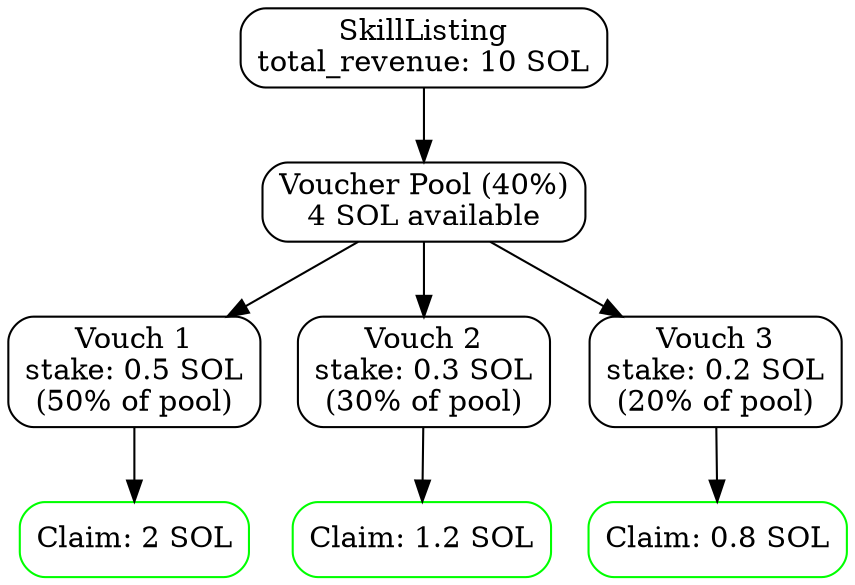

---

## Strengths & Weaknesses

### Strengths ✅

1. **Economic Alignment**
   - Skin-in-the-game through staking
   - Revenue sharing incentivizes quality vouches

2. **Transparent Provenance**
   - All vouches on-chain and queryable
   - Immutable audit trail

3. **Composable Trust**
   - Reputation scores are standardized
   - Other protocols can query on-chain

4. **Solana Performance**
   - Low transaction costs (~$0.0001)
   - Fast finality (~400ms)

5. **Anchor Framework**
   - Type-safe account validation
   - Automatic PDA derivation
   - IDL generation for clients

### Weaknesses ⚠️

1. **Centralized Dispute Resolution**
   - Admin has sole authority (current v1)
   - No DAO governance yet

2. **Incomplete Voucher Payouts**
   - 40% revenue tracked but not claimable
   - Requires additional instruction

3. **No Reputation Decay**
   - Old vouches count forever
   - No time-based depreciation

4. **Limited Dispute Evidence**
   - Only URI to off-chain data
   - No on-chain evidence storage

5. **Single-Chain Limitation**
   - Solana only (no cross-chain)
   - Reputation not portable

---

## Conclusion

Agent Reputation Oracle implements a novel trust layer for AI agents using economic incentives and transparent on-chain reputation. The architecture is well-structured with clear separation between reputation system and marketplace, though some features (voucher claims, DAO governance) remain unimplemented.

**Key Innovations:**
- Isnad chain pattern for trust propagation
- Stake-based vouching with slashing
- Revenue sharing between authors and vouchers

**Production Readiness:**
- ✅ Core functionality complete
- ✅ Comprehensive test coverage
- ⚠️ Centralized admin (needs DAO)
- ⚠️ Incomplete voucher payouts
- ⚠️ No mainnet deployment yet

**Recommended Next Steps:**
1. Implement `claim_voucher_revenue()` instruction
2. Add DAO governance for dispute resolution
3. On successful dispute resolution, payout the challenger to incentivize them to report malicious agents
3. Deploy to mainnet with audited code
4. Build agent integrations (Eliza, etc.)
5. Add cross-chain bridging, identity, and reputation system

---

## Appendix: File Structure

```
agent-reputation-oracle/
├── programs/
│   └── reputation-oracle/
│       ├── src/
│       │   ├── lib.rs                    # Program entry point
│       │   ├── state/
│       │   │   ├── agent.rs              # AgentProfile
│       │   │   ├── vouch.rs              # Vouch + VouchStatus
│       │   │   ├── dispute.rs            # Dispute + DisputeStatus
│       │   │   ├── config.rs             # ReputationConfig
│       │   │   ├── skill_listing.rs      # SkillListing
│       │   │   └── purchase.rs           # Purchase
│       │   └── instructions/
│       │       ├── initialize_config.rs
│       │       ├── register_agent.rs
│       │       ├── vouch.rs
│       │       ├── revoke_vouch.rs
│       │       ├── open_dispute.rs
│       │       ├── resolve_dispute.rs
│       │       ├── create_skill_listing.rs
│       │       └── purchase_skill.rs
│       └── Cargo.toml
├── web/
│   ├── app/
│   │   ├── page.tsx                      # Agent dashboard
│   │   ├── marketplace/page.tsx          # Skill marketplace
│   │   └── layout.tsx                    # Root layout
│   ├── hooks/
│   │   └── useReputationOracle.ts        # Program interaction hook
│   ├── components/
│   │   └── WalletContextProvider.tsx     # Wallet setup
│   └── package.json
├── tests/
│   ├── reputation-oracle.ts              # Integration tests
│   └── marketplace.test.ts               # Marketplace tests
├── scripts/
│   ├── init-config.ts                    # Initialize config
│   ├── register-agent.ts                 # Register test agent
│   ├── vouch.ts                          # Create test vouch
│   └── check-agent.ts                    # Query agent data
├── Anchor.toml                           # Anchor config
├── package.json                          # Root dependencies
└── README.md                             # Project overview
```

---

**Generated by:** Cursor AI Agent  
**Codebase Version:** Feb 12, 2026 (v2 with marketplace)  
**Analysis Tools:** Static code analysis + architecture extraction
